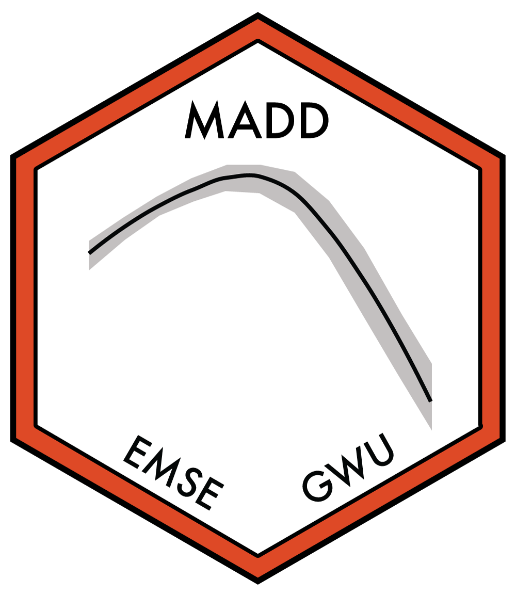

---
output:
  github_document:
    html_preview: false
---

<!-- README.md is generated from README.Rmd. Please edit that file -->

```{r child = "_knitr_setup.Rmd"}
```

## EMSE 6035: Marketing Analytics for Design Decisions - Fall 2021 <a href='https://github.com/emse-madd-gwu/2021-Fall'></a>

<!-- badges: start -->

[](https://creativecommons.org/licenses/by-sa/4.0/)
<!-- badges: end -->

### Description

```{r child = '_description.Rmd'}
```

For more details, please see the [course website](http://madd.seas.gwu.edu/2021-Fall/).

### Acknowledgments

This course was inspired by many other courses / resources that cover similar material - see the course [about page](http://madd.seas.gwu.edu/2021-Fall/about.html) for more details.
