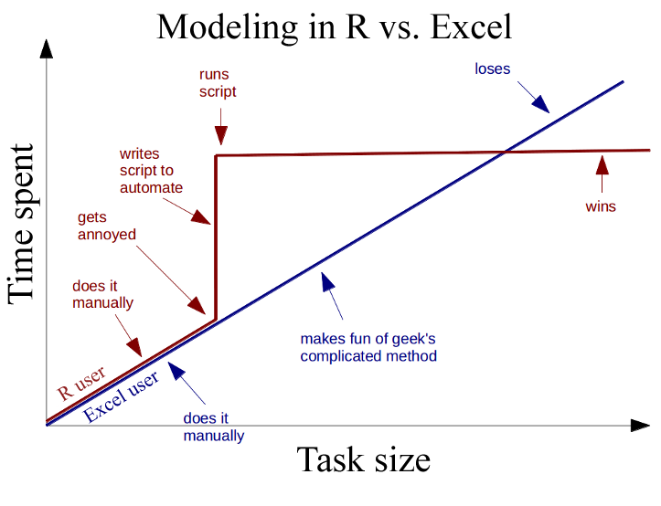
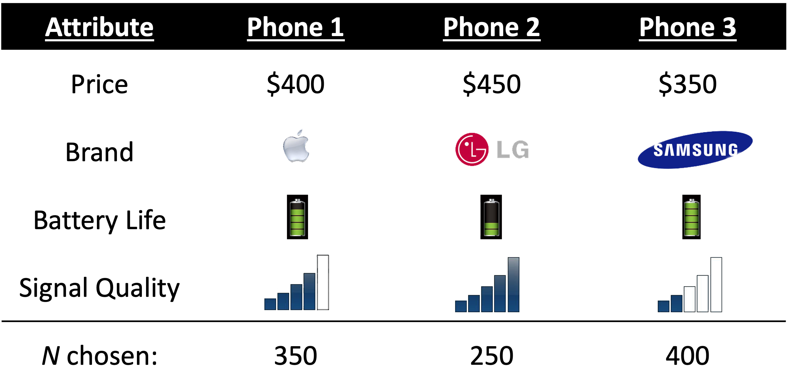
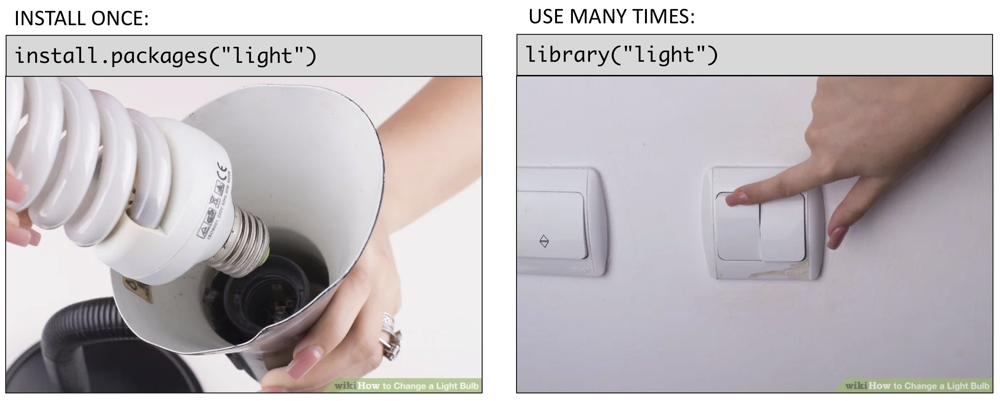

```{r setup, include=FALSE}
library(knitr)
library(tidyverse)
library(fontawesome)
library(countdown)
library(metathis)
library(viridis)
library(ggrepel)
library(cowplot)

options(
  htmltools.dir.version = FALSE,
  knitr.table.format = "html",
  knitr.kable.NA = '',
  dplyr.width = Inf,
  width = 250
)

knitr::opts_chunk$set(
  cache = FALSE,
  warning = FALSE,
  message = FALSE,
  fig.path = "figs/",
  fig.width = 7.252,
  fig.height = 4,
  comment = "#>",
  fig.retina = 3
)

# Setup xaringanExtra options
xaringanExtra::use_xaringan_extra(c(
  "tile_view", "panelset", "clipboard", "share_again"))
xaringanExtra::style_share_again(share_buttons = "none")
xaringanExtra::use_extra_styles(
  hover_code_line = TRUE,
  mute_unhighlighted_code = FALSE
)

# Set up website metadata
meta() %>%
  meta_general(
    description = rmarkdown::metadata$subtitle,
    generator = "xaringan and remark.js"
  ) %>%
  meta_name("github-repo" = "emse-madd-gwu/2021-Fall") %>%
  meta_social(
    title = rmarkdown::metadata$title,
    url = "https://madd.seas.gwu.edu/2021-Fall/",
    og_type = "website",
    og_author = "John Paul Helveston",
    twitter_card_type = "summary_large_image",
    twitter_creator = "@johnhelveston"
  )

# Setup class-specific paths
class <- "1-getting-started"
root <- paste0("https://madd.seas.gwu.edu/2021-Fall/class/", class, "/")
path_slides <- file.path("class", class, "index.html")
path_pdf <- paste0(root, class, ".pdf")
path_notes <- paste0(root, class, ".zip")
```

class: middle, inverse

.leftcol30[
<center>

</center>
]

.rightcol70[
# Week `r rmarkdown::metadata$week`: .fancy[`r rmarkdown::metadata$title`]

### `r fontawesome::fa(name = "university", fill = "white")` `r rmarkdown::metadata$subtitle`
### `r fontawesome::fa(name = "user", fill = "white")` `r rmarkdown::metadata$author`
### `r fontawesome::fa(name = "calendar-alt", fill = "white")` `r rmarkdown::metadata$date`
]

---

```{r child="topics/0.Rmd"}
```

---

```{r child="topics/1.Rmd"}
```

---

# Meet your instructor!

.leftcol30[.circle[

]]
.rightcol70[

### John Paul Helveston, Ph.D.

.font80[
Assistant Professor, Engineering Management & Systems Engineering

- 2016-2018 Postdoc at [Institute for Sustainable Energy](https://www.bu.edu/ise/), Boston University
- 2016 PhD in Engineering & Public Policy at Carnegie Mellon University
- 2015 MS in Engineering & Public Policy at Carnegie Mellon University
- 2010 BS in Engineering Science & Mechanics at Virginia Tech
- Website: [www.jhelvy.com](http://www.jhelvy.com/)
]]

---

# `r fa('tools')` Tools

<br>

--

## `r fa('globe')` Course website: https://madd.seas.gwu.edu/2021-Fall/

--

## `r fa('slack')` Course slack: https://emse-madd-f21.slack.com

--

## `r fa('r-project')` & RStudio: [installation instructions](https://madd.seas.gwu.edu/2021-Fall/ref-course-software.html)

---

class: center

# Why `r fa('r-project')`?

<center>

</center>

---

# Learning Objectives

### After this class, you will know how to... 

- ### ...work with data in `r fa('r-project')`
- ### ...design effective surveys to get rich data
- ### ...analyze consumer choice data to model consumer preferences
- ### ...design effective charts to communicate insights

---

# Course prerequisites 

.leftcol60[

### This course requires prior exposure to:

- ### Probability theory
- ### Multivariable calculus
- ### Linear algebra
- ### Regression
]

--

.rightcol40[

### **Not sure?** 

### Take [this self assessment](https://madd.seas.gwu.edu/2021-Fall/r0-self-assessment.html)

]

---

# Reflections (27% of grade)

### Do some readings, recorded lectures, practice problems

### Write a short reflection

--

## `r fa('calendar-alt')` ~Every week (9 total)

--

## `r fa('clock')` Due 11:59pm Tues. before class

--

## `r fa('check')` Graded for completion (looking for engagement)

---

# Quizzes (12% of grade)

--

## `r fa('calendar-alt')` In class every other week-ish (5 total, lowest dropped)

--

## `r fa('clock')` 5 minutes (3-5 questions)

--

## `r fa('tasks')` [Example quiz](https://p4aquizdemo.formr.org/)

--

> **Why quiz at all?** There's a phenomenon called the "retrieval effect" - basically, you have to _practice_ remembering things, otherwise your brain won't remember them (details in the book ["Make It Stick: The Science of Successful Learning"](https://www.hup.harvard.edu/catalog.php?isbn=9780674729018)).

---

# Exam (10% of grade)

### Take home exam, 2nd to last week of class

### We'll go over exam solutions on last day of class

---

# [Semester Project](https://madd.seas.gwu.edu/2021-Fall/p0-overview.html) (51% of grade)

.leftcol[
### Teams of 3-4 students 

### Goals: 

- Assess market viability of a new technology or design
- Recommend best design choices for target market or application

]

.rightcol[
### Key deliverables:


Item                  | Weight | Due
----------------------|--------|-------------------------------------
Proposal              | 7 %    | 9/26
Survey Plan           | 4 %    | 10/05
Pilot Survey          | 4 %    | 10/15
Pilot Analysis        | 9 %    | 11/07
Final Survey          | 5 %    | 11/21
Final Analysis Report | 14 %   | 12/13
Final Presentation    | 8 %    | 12/15
]

---

# .center[Grades]

Item                  | Weight | Notes
----------------------|--------|-------------------------------------
Reflections           | 27 %   | Weekly assignment (9 x 3%)
Quizzes               | 12 %   | 5 quizzes, lowest dropped
Project Proposal      | 7 %    | Teams of 3-4 students
Survey Plan           | 4 %    |
Pilot Survey          | 4 %    |
Pilot Analysis        | 9 %    |
Final Survey          | 5 %    |
Final Analysis Report | 14 %   |
Final Presentation    | 8 %    |
Final Exam            | 10 %   | Take home exam

---

class: center, middle
background-color: #FFF

# .center[Grades]

```{r grade-breakdown, echo=FALSE, fig.height=6, fig.width=10, fig.align='center'}
df <- data.frame(
    category = c(
      'Reflections', 'Quizzes', 'Project', 'Exam'),
    percent = c(27, 12, 51, 10)) %>%
    arrange(desc(percent)) %>%
    mutate(
      cumpercent = cumsum(percent),
      label_y = cumpercent - (percent / 2),
      category = fct_reorder(category, percent))

ggplot(df) +
    geom_col(aes(x = "", y = percent, fill = category),
             width = 1.1, alpha = 0.8) +
    geom_label(data = df,
               aes(x = "", y = label_y, label = category), size = 7) +
    coord_flip() +
    scale_y_continuous(expand = expansion(mult = c(0, 0.05))) +
    scale_fill_viridis(discrete = TRUE) +
    theme_minimal_vgrid(font_size = 24) +
    theme(legend.position = 'none') +
    labs(y = 'Percent of final grade', x = NULL)
```

---

# Course policies

--

.leftcol35[
- ## BE NICE
- ## BE HONEST
- ## DON'T CHEAT
]

--

.rightcol65[
## .center[Copying is good, stealing is bad]

> "Plagiarism is trying to pass someone else's work off as your own. Copying is about reverse-engineering."
>
> .right[-- Austin Kleon, from [Steal Like An Artist](https://austinkleon.com/steal/)&ensp;]
]

---

# Late submissions

## - **5** late days - use them anytime, no questions asked
## - No more than **2** late days on any one assignment
## - Contact me for special cases

---

# How to succeed in this class

--

## `r fa("users")` Participate during class!

--

## `r fa("pencil-ruler")` Start assignments early and **read carefully**!

--

## `r fa("bed")` Get sleep and take breaks often!

--

## `r fa("people-carry")` Ask for help!

---

# [Getting Help](https://madd.seas.gwu.edu/2021-Fall/ref-getting-help.html)

--

## `r fa('slack')` Use [Slack](https://emse-madd-f21.slack.com/) to ask questions.

--

## `r fa('user-clock')` [Schedule a meeting](https://jhelvy.appointlet.com/b/professor-helveston) w/Prof. Helveston:

- Mondays from 8:00-5:00pm
- Tuesday from 1:00-5:00pm
- Thursdays from 12:00-5:00pm

--

## `r fa('code')` [GW Coders](http://gwcoders.github.io/)

---

```{r child="topics/2.Rmd"}
```

---

## We want to answers to questions like...

<br>

--

### - Higher prices decrease demand, but by how much?

--

### - How much more is a consumer willing to pay for increased performance in X?

--

### - How will my product compete against competitors in the market?

--

## **Answers depend on knowing what people want**

---

class: center 

## Directly asking people what they want isn't always helpful

--

### (People want everything)

<center>

</center>

---

class: center, middle 

## Which feature do you care more about?

<center>

</center>

.cols3[
## .center[Battery Life?]
<center>

</center>
]

.cols3[
## .center[Brand?]
<center>

</center>
]

.cols3[
## .center[Signal quality?]
<center>

</center>
]

---

class: center

## **Conjoint approach**:<br>Use consumer choice data to model preferences

<center>

</center>

---

### .center[Use random utility framework to predict probability of choosing phone _j_]

<br>

--

### 1. $u_j = \beta_1\mathrm{price}_j + \beta_2\mathrm{brand}_j + \beta_3\mathrm{battery}_j + \beta_4\mathrm{signal}_j + \varepsilon_j$

--

### 2. Assume $\varepsilon_j \sim$ iid extreme value 

--

### 3. Probability of choosing phone _j_: $P_j = \frac{e^{\beta'x_j}}{\sum_k^J e^{\beta'x_k}}$

--

### 4. Estimate $\beta_1$, $\beta_2$, $\beta_3$, $\beta_4$ by minimizing $-L = - \sum_n^N \sum_j^J y_{nj} \ln P_{nj}$ 

---

class: center 

.leftcol[.center[
## **Willingness to Pay**

<br>

## $u_j = \beta'x_j + \alpha p_j + \varepsilon_j$ 

## $\omega = \frac{\beta}{-\alpha}$

.font120["Respondents on average are willing to pay $XX to improve battery life by XX%"]
]]

--

.rightcol[
## **Make predictions**

### $P_j = \frac{e^{\hat{\beta}'x_j}}{\sum_k^J e^{\hat{\beta}'x_k}}$

<center>

</center>
]

---

class: center, inverse, middle

# Example:<br>Athletic Sole Insole Sensor

---

class: center
background-color: #fff

# Product: Electronic Shoe Sensor

<center>

</center>

---

class: center, middle
background-color: #fff

<center>

</center>

---

class: center, middle
background-color: #fff

<center>

</center>

---

class: center, middle
background-color: #fff

<center>

</center>

---

class: center, inverse, middle

# Your project starts now!

# [View project Ideas](https://docs.google.com/presentation/d/1URUctaP2sQcdXopdiibj9aZIrVkxi2PUy6ALh2r3EH4/edit?usp=sharing)

---

```{r child="topics/3.Rmd"}
```

---

# Introduce yourself 

## - Preferred name
## - Degree program
## - Prior experience
## - What do you hope to gain from this class?
## - Project interests?

---

class: center, middle, inverse 

# Break: Teaming

---

```{r child="topics/4.Rmd"}
```

---

# RStudio Orientation

.leftcol70[
<center>

</center>
]

.rightcol30[
- Know the boxes
- Customize the layout
- Customize the look
- [Extra themes](https://github.com/gadenbuie/rsthemes)
]

---

class: center, middle, inverse

# Open `intro_to_R.R` file and follow along

---

# View prior code in history pane


--

# Use "up" arrow see previous code

---

# Staying organized

--

## 1) Save your code in .R files

> ### &zwj;File > New File > R Script

--

## 2) Keep work in R Project files

> ### File > New Project...

---
class: inverse

```{r, echo=FALSE}
countdown(minutes = 10,
          warn_when = 30,
          update_every = 15,
          bottom = 0,
          left = 0,
          font_size = '2em')
```

.leftcol[.font80[
## Your turn

### A. Practice getting organized

1. Open RStudio and create a new R project called `week1`.
2. Create a new R script and save it as `practice.R`.
3. Open the `practice.R` file and write your answers to these questions in it.
]]

.rightcol[.font80[
### B. Creating & working with objects

1). Create objects to store the values in this table:

| City              | Area (sq. mi.) | Population (thousands) |
|-------------------|----------------|------------------------|
| San Francisco, CA | 47             | 884                    |
| Chicago, IL       | 228            | 2,716                  |
| Washington, DC    | 61             | 694                    |

2) Using the objects you created, answer the following questions:

  - Which city has the highest density?
  - How many _more_ people would need to live in DC for it to have the same population density as San Francisco?

```{r, eval=FALSE, echo=FALSE}
# Create values
area_sf <- 47
area_chicago <- 228
area_dc <- 61
pop_sf <- 884
pop_chicago <- 2716
pop_dc <- 694

# Compute densities
dens_sf <- pop_sf / area_sf
dens_chicago <- pop_chicago / area_chicago
dens_dc <- pop_dc / area_dc
dens_sf
dens_chicago
dens_dc

# Compute addition DC population to match SF density
(dens_sf*area_dc) - pop_dc
```
]]

---

class: center, middle
background-color: #fff 

# >15,000 [packages](https://cran.r-project.org/web/packages/available_packages_by_name.html) on the [CRAN](https://cran.r-project.org/)

<center>

</center>

---

# Installing packages

--

### `install.packages("packagename")`
### (The package name **must** be in quotes)

```{r eval=FALSE}
install.packages("packagename") # This works
install.packages(packagename)   # This doesn't work
```

--

### **You only need to install a package once!**

---

# Loading packages

--

### `library(packagename)`: Loads all the functions in a package
### (The package name _doesn't_ need to be in quotes)

```{r eval=FALSE}
library("packagename") # This works
library(packagename)   # This also works
```

--

### **You need to _load_ the package every time you use it!**

---

background-color: #fff
class: center

# Installing vs. Loading

<center>

</center>

---

## Example: **wikifacts**

Install the [Wikifacts](https://github.com/keithmcnulty/wikifacts) package, by Keith McNulty:

```{r eval=FALSE}
install.packages("wikifacts")
```

--

Load the package:

```{r eval=FALSE}
library(wikifacts) # Load the library
```

--

Use one of the package functions

```{r eval=FALSE}
wiki_randomfact()
```
```{r echo=FALSE}
wikifacts::wiki_randomfact()
```

---

## Example: **wikifacts**

Now, restart your RStudio session:
> Session -> Restart R

--

Try using the package function again:

```{r, error=TRUE}
wiki_randomfact()
```

---

# Using only _some_ package functions

### You don't always have to load the whole library.

--

### Functions can be accessed with this pattern:
`packagename::functionname()`

--

```{r}
wikifacts::wiki_randomfact()
```

---

class: inverse, center, middle

## If you haven't yet, install [these packages](https://raw.githubusercontent.com/emse-madd-gwu/examples/main/code/0-install.R)

---

class: center, middle, inverse

# Back `intro_to_R.R` for the rest of class!
