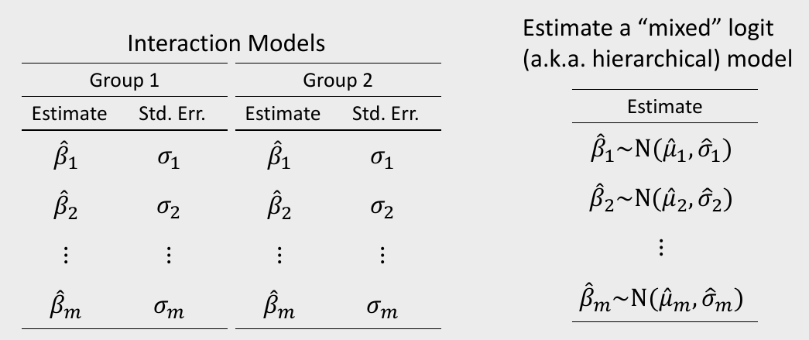
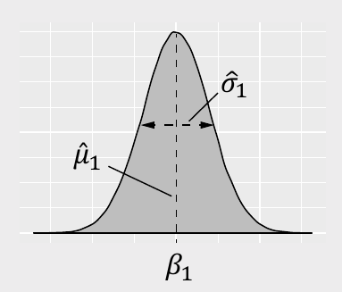

```{r, child="../setup.Rmd"}
```

---

class: inverse

# Quiz 5 (last one!)

```{r, echo=FALSE}
countdown(
    minutes = 10,
    warn_when = 30,
    update_every = 1,
    bottom = 0,
    left = 0,
    font_size = '4em'
)
```

.leftcol[
### Make sure to download the zip file on the first page!
]

.rightcol[
<center>

</center>
]

---

# Houskeeping items 

- **Final presentations** will be on 12/15, we will (hopefully) have a guest panel to ask questions.

--

- **Final reports** (due 12/13) will also be an html page report. 

- I am planning on posting all reports (without grades) to the course site as a showcase for future students - **please DM me if you would NOT like your report posted**. ([example](https://eda.seas.gwu.edu/) from EMSE 4572)

---

```{r child="topics/0.Rmd"}
```

---

```{r child="topics/1.Rmd"}
```

---

class: center

# Two ways of modeling heterogeneity 

.leftcol[
.red["Observed Heterogeneity"]
]

.rightcol[
.red["Unobserved Heterogeneity"]
]

<center>

</center>

---

## .center[Mixed logit]

### Preference parameters follow a distribution<br>**across sample population**

.leftcol[
<center>

</center>
]

.rightcol[
## $$\tilde{u}_j = \beta_1 x_j + \varepsilon_j$$

## $$\beta_1 \sim \mathrm{N} (\mu_1, \sigma_1)$$

Parameter | Estimate | Standard Error 
----------|----------|-----------------
$\mu_1$   | 0.1      | 0.01
$\sigma_1$ | 0.1      | 0.01
]

---

## Which distribution should I use? 

.cols3[
**Normal distribution**

When preferences can be positive or negative

e.g. `brand = "n"`

```{r, echo=FALSE}
x <- seq(0, 3, 0.01)
data.frame(
  x = x,
  y = dnorm(x, 1.5, 0.5)) %>% 
  ggplot() + 
  geom_line(aes(x = x, y = y)) + 
  theme_bw() + 
  labs(x = "brand")
```
]

--

.cols3[
**Log-normal distribution**

When preferences should be strictly positive

e.g. `price = "ln"`

```{r, echo=FALSE}
x <- seq(0, 3, 0.01)
data.frame(
  x = x,
  y = dlnorm(x, 0, 0.4)) %>% 
  ggplot() + 
  geom_line(aes(x = x, y = y)) + 
  theme_bw() + 
  labs(x = "price")
```
]

--

.cols3[
**Fixed parameter**

When preferences appear to be homogeneous 

(e.g. $\sigma$ is very small)

```{r, echo=FALSE}
x <- seq(0, 3, 0.01)
data.frame(
  x = x,
  y = dnorm(x, 1.5, 0.1)) %>% 
  ggplot() + 
  geom_line(aes(x = x, y = y)) + 
  theme_bw() + 
  labs(x = "brand")
```
]

---

class: center

### Mixed logits are not equivalent in Preference vs. WTP space

.leftcol[
### Preference space

### $$\tilde{u}_j = \alpha p_j + \beta x_j + \varepsilon_j$$

### $$\alpha \sim \ln\mathrm{N} (\mu_1, \sigma_1)$$

### $$\beta \sim \mathrm{N} (\mu_2, \sigma_2)$$
]

---

class: center

### Mixed logits are not equivalent in Preference vs. WTP space

.leftcol[
### Preference space

### $$\tilde{u}_j = \alpha p_j + \beta x_j + \varepsilon_j$$

### $$\alpha \sim \ln\mathrm{N} (\mu_1, \sigma_1)$$

### $$\beta \sim \mathrm{N} (\mu_2, \sigma_2)$$

### $$\omega = \frac{\beta}{-\alpha} = \frac{\mathrm{N} (\mu_2, \sigma_2)}{- \ln\mathrm{N} (\mu_1, \sigma_1)}$$
]

--

.rightcol[
### WTP space

### $$\tilde{u}_j = \lambda(\omega_1 x_j - p_j) + \varepsilon_j$$

### $$\omega_1 \sim \mathrm{N} (\mu_1, \sigma_1)$$
]

---

class: inverse

# Practice Question 3

a) Use the `logitr` package to estimate the following homogeneous model:

$$
\tilde{u}_j = \beta_1 x_j^{\mathrm{price}} + \beta_2 \delta_j^{\mathrm{feat}} + \beta_3 \delta_j^{\mathrm{dannon}} + \beta_4 \delta_j^{\mathrm{hiland}} + 
\beta_5 \delta_j^{\mathrm{weight}} + \varepsilon_j
$$

where the three $\delta$ coefficients are dummy variables for Dannon, Hiland, and Weight Watchers brands (Yoplait is the reference level).

b) Use the `logitr` package to estimate the same model but with the following mixing distributions:

- $\beta_1 \sim \mathrm{N} (\mu_1, \sigma_1)$
- $\beta_2 \sim \mathrm{N} (\mu_2, \sigma_2)$

---

# .center[Estimating mixed logit models with `logitr`]

<br>

.rightcol80[
## 1. Open `logitr-cars`

## 2. Open `code/8.1-model-mxl.R`
]

---

class: inverse

```{r, echo=FALSE}
countdown(
  minutes = 15,
  warn_when = 15,
  update_every = 1,
  top = 0,
  right = 0,
  font_size = '2em'
)
```

## Your Turn

.leftcol80[.font120[
As a team, re-estimate the main model you used in your pilot analysis report, but now using a mixed logit model.

Carefully consider which distributions to use (i.e., normal or log-normal) for different variables.
]]

---

class: inverse, center

# .fancy[Break]

```{r, echo=FALSE}
countdown(
  minutes = 5,
  warn_when = 30,
  update_every = 1,
  left = 0, right = 0, top = 1, bottom = 0,
  margin = "5%",
  font_size = "8em"
)
```

---

```{r child="topics/2.Rmd"}
```

---

class: center

# Two ways of modeling heterogeneity 

.leftcol[
.red["Observed Heterogeneity"]
]

.rightcol[
.red["Unobserved Heterogeneity"]
]

<center>

</center>

---

class: middle

### .center[Use interactions to model preferences for multiple groups]

.leftcol[
### Homogenous model: 

### $\tilde{u}_j = \beta_1 x_j + \varepsilon_j$

### Two groups: A & B

### $\tilde{u}_j = \beta_1 x_j + \beta_2 x_j \delta^\mathrm{B} + \varepsilon_j$

### $\quad = (\beta_1 + \beta_2 \delta^\mathrm{B}) x_j + \varepsilon_j$

]

.rightcol[

Par.| Meaning 
----|--------
$\beta_1$ | Effect of $x_j$ for group A
$\beta_2$ | _Difference_ in effect of $x_j$ between groups

]

---

class: center 

# What's the difference?

.leftcol[
## Separate models `r fontawesome::fa(name = "times-circle", fill = "red")`

$$
\tilde{u}_j^\mathrm{A} = \beta_1^\mathrm{A} x_j + \varepsilon_j^\mathrm{A}
$$

$$
\tilde{u}_j^\mathrm{B} = \beta_1^\mathrm{B} x_j + \varepsilon_j^\mathrm{B}
$$
]

.rightcol[
## Single model `r fontawesome::fa(name = "check", fill = "green")`

$$\tilde{u}_j = \beta_1 x_j + \beta_2 x_j \delta^\mathrm{B} + \varepsilon_j$$
]

---

# .center[Accounting for scale differences]

.leftcol[
## .center[Separate models `r fontawesome::fa(name = "times-circle", fill = "red")`]

$$
\tilde{u}_j^\mathrm{A} = \alpha^\mathrm{A} p_j + \beta_1^\mathrm{A} x_j + \varepsilon_j^\mathrm{A}
$$

$$
\tilde{u}_j^\mathrm{B} = \alpha^\mathrm{B} p_j + \beta_1^\mathrm{B} x_j + \varepsilon_j^\mathrm{B}
$$

Imagine you got the following results 

- $\hat{\alpha}^\mathrm{A}$ = 100
- $\hat{\beta}^\mathrm{A}$ = 200
- $\hat{\alpha}^\mathrm{B}$ = 1
- $\hat{\beta}^\mathrm{B}$ = 2
]

--

.rightcol[
## .center[Single model `r fontawesome::fa(name = "check", fill = "green")`]

$$\tilde{u}_j = \alpha_1 p_j + \alpha_2 p_j \delta^\mathrm{B} + \beta_1 x_j + \beta_2 x_j \delta^\mathrm{B} + \varepsilon_j$$

$$\quad = (\alpha_1 + \alpha_2 \delta^\mathrm{B}) p_j + (\beta_1 + \beta_2 \delta^\mathrm{B}) x_j + \varepsilon_j$$
]

---

# .center[Accounting for scale differences]

.leftcol[
## .center[Preference Space `r fontawesome::fa(name = "times-circle", fill = "red")`]

$$
\tilde{u}_j^\mathrm{A} = \alpha^\mathrm{A} p_j + \beta_1^\mathrm{A} x_j + \varepsilon_j^\mathrm{A}
$$

$$
\tilde{u}_j^\mathrm{B} = \alpha^\mathrm{B} p_j + \beta_1^\mathrm{B} x_j + \varepsilon_j^\mathrm{B}
$$

Imagine you got the following results 

- $\hat{\alpha}^\mathrm{A}$ = 100
- $\hat{\beta}^\mathrm{A}$ = 200
- $\hat{\alpha}^\mathrm{B}$ = 1
- $\hat{\beta}^\mathrm{B}$ = 2
]

--

.rightcol[
## .center[WTP Space `r fontawesome::fa(name = "check", fill = "green")`]

$$
\tilde{u}_j^\mathrm{A} = \lambda^\mathrm{A}(\omega_1^\mathrm{A} x_j - p) + \varepsilon_j^\mathrm{A}
$$

$$
\tilde{u}_j^\mathrm{B} = \lambda^\mathrm{B}(\omega_1^\mathrm{B} x_j - p) + \varepsilon_j^\mathrm{B}
$$

$$
\omega = \frac{\beta}{- \alpha}
$$

- $\hat{\omega}^\mathrm{A} = 200 / (-100) = -2$
- $\hat{\omega}^\mathrm{B} = 2 / (-1) = -2$

]

---

class: inverse

# Practice Question 1

Suppose we estimate the following utility model describing preferences for cars:

$$
\tilde{u}_j = \beta_1 x_j^{\mathrm{price}} + \beta_2 x_j^{\mathrm{mpg}} + \beta_3 x_j^{\mathrm{elec}} + \varepsilon_j
$$

a) Using interactions, write out a model that accounts for differences in the effects of $x_j^{\mathrm{price}}$, $x_j^{\mathrm{mpg}}$, and $x_j^{\mathrm{elec}}$ between two groups: A and B.

b) Write out the effects of $x_j^{\mathrm{price}}$, $x_j^{\mathrm{mpg}}$, and $x_j^{\mathrm{elec}}$ for each group.

---

class: inverse

# Practice Question 2

Suppose we estimate the following utility model describing preferences for chocolate bars between two groups: A & B

$$
\tilde{u}_j = \beta_1 x_j^{\mathrm{price}} + \beta_2 x_j^{\mathrm{caco}} + \beta_3 x_j^{\mathrm{price}}\delta_j^{\mathrm{B}} + \beta_4 x_j^{\mathrm{cacao}}\delta_j^{\mathrm{B}} + \varepsilon_j
$$

.leftcol55[
The estimated model produces the following coefficients and hessian:

$\beta$ = [-0.7, 0.1, 0.2, 0.8]

$$
H =
\begin{bmatrix}
-6000 & 50 & 60 & 70
\\
50 & -700 & 50 & 100
\\
60 & 50 & -300 & 20
\\
70 & 100 & 20 & -6000
\end{bmatrix}
$$
]

.rightcol45[
a) Use the `mvrnorm()` function from the `MASS` library to generate 10,000 draws of the model coefficients.

b) Use the draws to compute the mean WTP and 95% confidence intervals of the effects of $x_j^{\mathrm{price}}$ and $x_j^{\mathrm{cacao}}$ for each group (A & B).
]

---

# .center[Estimating mixed logit models with `logitr`]

<br>

## 1. Open `logitr-cars`

## 2. Open `code/8.2-model-mnl-groups.R`

---

class: inverse

```{r, echo=FALSE}
countdown(
  minutes = 20,
  warn_when = 15,
  update_every = 1,
  top = 0,
  right = 0,
  font_size = '2em'
)
```

## Your Turn

### Do this individually, and compare with your teammates:

.leftcol80[.font120[
- Examine the demographic and other variables in your pilot data and specify a model that estimates differences between different groups.
- Write code to estimate that model (or multiple models, e.g. WTP space models).
- Compute and compare WTP across the different groups.
]]
