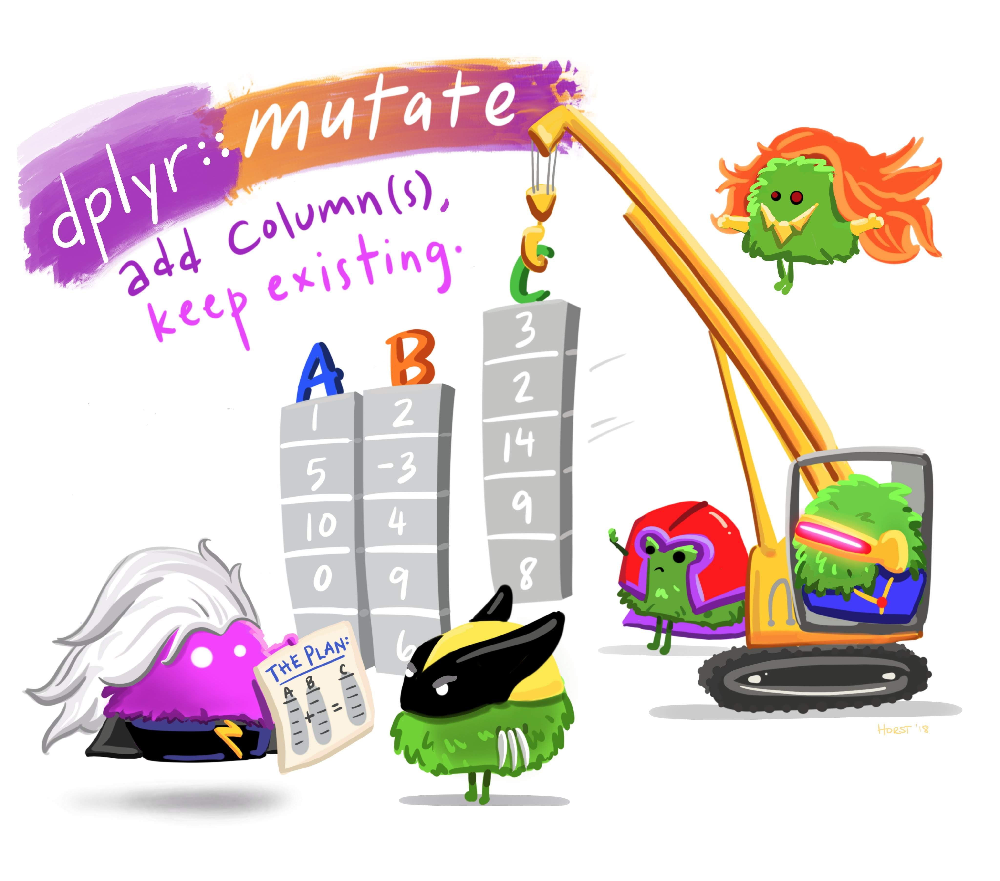

```{r setup, include=FALSE}
library(knitr)
library(tidyverse)
library(fontawesome)
library(countdown)
library(metathis)

options(
  htmltools.dir.version = FALSE,
  knitr.table.format = "html",
  knitr.kable.NA = '',
  dplyr.width = Inf,
  width = 250
)

knitr::opts_chunk$set(
  cache = FALSE,
  warning = FALSE,
  message = FALSE,
  fig.path = "figs/",
  fig.width = 7.252,
  fig.height = 4,
  comment = "#>",
  fig.retina = 3
)

# Setup xaringanExtra options
xaringanExtra::use_xaringan_extra(c(
  "tile_view", "panelset", "clipboard", "share_again"))
xaringanExtra::style_share_again(share_buttons = "none")
xaringanExtra::use_extra_styles(
  hover_code_line = TRUE,
  mute_unhighlighted_code = FALSE
)

# Set up website metadata
meta() %>%
  meta_general(
    description = rmarkdown::metadata$subtitle,
    generator = "xaringan and remark.js"
  ) %>%
  meta_name("github-repo" = "emse-madd-gwu/2021-Fall") %>%
  meta_social(
    title = rmarkdown::metadata$title,
    url = "https://madd.seas.gwu.edu/2021-Fall/",
    og_type = "website",
    og_author = "John Paul Helveston",
    twitter_card_type = "summary_large_image",
    twitter_creator = "@johnhelveston"
  )

# Setup class-specific paths
class <- "2-data-wrangling"
root <- paste0("https://madd.seas.gwu.edu/2021-Fall/class/", class, "/")
path_slides <- file.path("class", class, "index.html")
path_pdf <- paste0(root, class, ".pdf")
path_notes <- paste0(root, class, ".zip")
```

class: middle, inverse

.leftcol30[
<center>

</center>
]

.rightcol70[
# Week `r rmarkdown::metadata$week`: .fancy[`r rmarkdown::metadata$title`]

### `r fontawesome::fa(name = "university", fill = "white")` `r rmarkdown::metadata$subtitle`
### `r fontawesome::fa(name = "user", fill = "white")` `r rmarkdown::metadata$author`
### `r fontawesome::fa(name = "calendar-alt", fill = "white")` `r rmarkdown::metadata$date`
]

---

# Required Packages (check `notes.R` file)

Make sure you have these libraries installed:

```{r, eval=FALSE}
install.packages(c("tidyverse", "here"))
```

**Remember: you only need to install packages once!**

--

<br>

Once installed, you'll need to _load_ the libraries every time you open RStudio:

```{r, eval=FALSE}
library(tidyverse)
library(here)
```

---

```{r child="topics/0.Rmd"}
```

---

```{r child="topics/1.Rmd"}
```

---

class: center

# The data frame...in Excel

<center>

</center>

---

# The data frame...in R

```{r}
beatles <- tibble(
    firstName   = c("John", "Paul", "Ringo", "George"),
    lastName    = c("Lennon", "McCartney", "Starr", "Harrison"),
    instrument  = c("guitar", "bass", "drums", "guitar"),
    yearOfBirth = c(1940, 1942, 1940, 1943),
    deceased    = c(TRUE, FALSE, FALSE, TRUE)
)

beatles
```

---

## **Columns**: _Vectors_ of values (must be same data type)

```{r}
beatles
```

--

Extract a column using `$`

```{r}
beatles$firstName
```

---

## **Rows**: Information about individual observations

Information about _John Lennon_ is in the first row:

```{r}
beatles[1,]
```

--

Information about _Paul McCartney_ is in the second row:

```{r}
beatles[2,]
```

---

class: middle, center, inverse

## Take a look at the `beatles` data frame in `notes.R`

---

# Getting data into R

<br>

## 1. Load external packages
## 2. Read in external files (usually a `.csv`* file)

<br>

*csv = "comma-separated values"

---

## Data from an R package

```{r, eval=FALSE, message=FALSE}
library(ggplot2)
```

--

See which data frames are available in a package:

```{r, eval=FALSE}
data(package = "ggplot2")
```

--

Find out more about a package data set:

```{r, eval=FALSE}
?msleep
```

---

class: middle, center, inverse

## Back to `notes.R`

---

# Importing an external data file

<br>

.leftcol60[
Note the `data.csv` file in your `data` folder.

- **DO NOT** double-click it!
- **DO NOT** open it in Excel!

Excel can **corrupt** your data!
]

--

.rightcol40[
If you **must** open it in Excel:

- Make a copy 
- Open the copy
]

---

# Steps to importing external data files

--

## 1. Create a path to the data

```{r}
library(here)
path_to_data <- here('data', 'data.csv') #<<
path_to_data
```

--

## 2. Import the data

```{r, eval=FALSE}
library(tidyverse)
data <- read_csv(path_to_data) #<<
```

---

## Using the **here** package to make file paths

The `here()` function builds the path to your **root** to your _working directory_ <br>(this is where your `.Rproj` file lives!)

```{r}
here()
```

--

The `here()` function builds the path to files _inside_ your working directory

```{r}
path_to_data <- here('data', 'data.csv')
path_to_data
```

---

# Avoid hard-coding file paths!

### (they can break on different computers)

```{r}
path_to_data <- 'data/data.csv'
path_to_data
```

# `r emo::ji("poop")``r emo::ji("poop")``r emo::ji("poop")`

---

# Back to reading in data

```{r, eval=FALSE}
path_to_data <- here('data', 'data.csv')
data <- read_csv(path_to_data) #<<
```

<br>

**Important**: Use `read_csv()` instead of `read.csv()`

---

class: inverse

```{r, echo=FALSE}
countdown(minutes = 10,
          warn_when = 30,
          update_every = 1,
          top = 0,
          right = 0,
          font_size = '2em')
```

## Think-Pair-Share

.font90[
1) Use the `here()` and `read_csv()` functions to load the `data.csv` file that is in the `data` folder. Name the data frame object `data`.

2) Use the `data` object to answer the following questions:

- How many rows and columns are in the data frame?
- What type of data is each column? (Just look, don't need to type out the answer)
- Preview the different columns - what do you think this data is about? What might one row represent?
- How many unique airlines are in the data frame? 
- What is the earliest and latest observation in the data frame?
- What is the shortest and longest air time for any one flight in the data frame?
]

---

```{r child="topics/2.Rmd"}
```

---

class: center

### The tidyverse: `stringr` + `dplyr` + `readr` +  `ggplot2` + ...

<center>

</center>Art by [Allison Horst](https://www.allisonhorst.com/)

---

class: center

# 80% of the job is data wrangling

.noborder[<center>

</center>]

---

class: center

## Today: data wrangling with **dplyr**

<center>

</center>Art by [Allison Horst](https://www.allisonhorst.com/)

---

# .center[The main `dplyr` "verbs"]

<br>

"Verb"        | What it does
--------------|--------------------
`select()`    | Select columns by name
`filter()`    | Keep rows that match criteria
`arrange()`   | Sort rows based on column(s)
`mutate()`    | Create new columns 
`summarize()` | Create summary values 

---

# .center[Core `tidyverse` concept:<br>**Chain functions together with "pipes"**]

# .center[`%>%`]

--

## Think of the words "...and then..."

```{r, eval=FALSE}
data %>% 
  do_something() %>% 
  do_something_else()
```

---

# Think of `%>%` as the words "...and then..."

--

**Without Pipes** (read from inside-out):
```{r, eval=FALSE}
leave_house(get_dressed(get_out_of_bed(wake_up(me))))
```

--

**With Pipes**:
```{r, eval=FALSE}
me %>%
    wake_up %>%
    get_out_of_bed %>%
    get_dressed %>%
    leave_house
```

---

class: center, middle, inverse

# Select columns with `select()`

<br>
<center>

</center>

---

# Select columns with `select()`

```{r}
beatles <- tibble(
    firstName   = c("John", "Paul", "Ringo", "George"),
    lastName    = c("Lennon", "McCartney", "Starr", "Harrison"),
    instrument  = c("guitar", "bass", "drums", "guitar"),
    yearOfBirth = c(1940, 1942, 1940, 1943),
    deceased    = c(TRUE, FALSE, FALSE, TRUE)
)

beatles
```

---

# Select columns with `select()`

Select the columns `firstName` & `lastName`

```{r}
beatles %>% 
  select(firstName, lastName)
```

---

# Select columns with `select()`

Use the `-` sign to drop columns

```{r}
beatles %>% 
  select(-firstName, -lastName)
```

---

# Select columns with `select()`

Select columns based on name criteria:

- `ends_with()` = Select columns that end with a character string
- `contains()` = Select columns that contain a character string
- `matches()` = Select columns that match a regular expression
- `one_of()` = Select column names that are from a group of names

---

# Select columns with `select()`

Select the columns that end with `"Name"`:

```{r}
beatles %>% 
  select(ends_with("Name"))
```

---

class: center, middle, inverse

# Select rows with `filter()`

<br>
<center>

</center>

---

# Select rows with `filter()`

Select the band members born after 1941

```{r, eval=FALSE}
#> # A tibble: 4 × 5
#>   firstName lastName  instrument yearOfBirth deceased
#>   <chr>     <chr>     <chr>            <dbl> <lgl>   
#> 1 John      Lennon    guitar            1940 TRUE    
#> 2 Paul      McCartney bass              1942 FALSE  #<<
#> 3 Ringo     Starr     drums             1940 FALSE   
#> 4 George    Harrison  guitar            1943 TRUE   #<<  
```

---

# Select rows with `filter()`

Select the band members born after 1941

```{r}
beatles %>% 
  filter(yearOfBirth > 1941)
```

---

# Select rows with `filter()`

Select the band members born after 1941 **& are still living**

```{r}
beatles %>% 
  filter(yearOfBirth > 1941, deceased == FALSE)
```

--

```{r}
beatles %>% 
  filter(yearOfBirth > 1941 & deceased == FALSE)
```

---

# .center[Logic operators for `filter()`]

<br>

Description | Example
------------|------------
Values greater than 1 | `value > 1`
Values greater than or equal to 1 | `value >= 1`
Values less than 1 | `value < 1`
Values less than or equal to 1 | `value <= 1`
Values equal to 1 | `value == 1`
Values not equal to 1 | `value != 1`
Values in the set c(1, 4) | `value %in% c(1, 4)`

---

# Removing missing values

Drop all rows where `variable` is `NA`

```{r, eval=FALSE}
data %>% 
    filter(!is.na(variable))
```

---

# Combine `filter()` and `select()`

Get the **first & last name** of members born after 1941 & are still living

```{r}
beatles %>% 
  filter(yearOfBirth > 1941, deceased == FALSE) %>% 
  select(firstName, lastName)
```

---

class: inverse

```{r, echo=FALSE}
countdown(minutes = 10,
          warn_when = 30,
          update_every = 1,
          top = 0,
          right = 0,
          font_size = '2em')
```

## Think-Pair-Share

.font90[
1) Use the `here()` and `read_csv()` functions to load the `data.csv` file that is in the `data` folder. Name the data frame object `data`.

2) Use the `data` object and the `select()` and `filter()` functions to answer the following questions:

- Create a new data frame, `flights_fall`, that contains only flights that departed in the fall semester.
- Create a new data frame, `flights_dc`, that contains only flights that flew to DC airports (Reagan or Dulles).
- Create a new data frame, `flights_dc_carrier`, that contains only flights that flew to DC airports (Reagan or Dulles) and only the columns about the month and airline.
- How many unique airlines were flying to DC airports in July?
]

---

class: center, middle, inverse

## Create new variables with `mutate()`

<br>
<center>

</center>

---

class: center
background-color: #fff

<center>

</center>Art by [Allison Horst](https://www.allisonhorst.com/)

---

# Create new variables with `mutate()`

Use the `yearOfBirth` variable to compute the age of each band member

```{r}
beatles %>%
    mutate(age = 2021 - yearOfBirth)
```

---

# You can _immediately_ use new variables

```{r}
beatles %>%
    mutate(
        age = 2021 - yearOfBirth, 
        meanAge = mean(age)) #<<
```

---

# .center[Handling if/else conditions]

### .center[`ifelse(<condition>, <if TRUE>, <else>)`]

--

```{r}
beatles %>%
    mutate(playsGuitar = ifelse(instrument == "guitar", TRUE, FALSE))
```

---

# Sort data frame with `arrange()`

--

Sort `beatles` data frame by year of birth

```{r}
beatles %>%
    arrange(yearOfBirth)
```

---

# Sort data frame with `arrange()`

Use the `desc()` function to sort in descending order

```{r}
beatles %>%
    arrange(desc(yearOfBirth)) #<<
```

---

# Sort rows with `arrange()`

Compute the band member age, then sort based on the youngest:

```{r}
beatles %>%
    mutate(age = 2021 - yearOfBirth) %>% 
    arrange(age)
```

---

class: inverse

```{r, echo=FALSE}
countdown(minutes = 10,
          warn_when = 30,
          update_every = 1,
          top = 0,
          right = 0,
          font_size = '2em')
```

## Think pair share

.font90[
1) Use the `here()` and `read_csv()` functions to load the `data.csv` file that is in the `data` folder. Name the data frame object `data`.

2) Using the `data` object, create the following new variables:

- `speed`: The speed in mph, computed from the time (in minutes) and distance (in miles) variables. 
- `dep_delay_hour`: Is `TRUE` if the departure delay is greater or equal to one hour, `FALSE` otherwise.

3) Which flight flew the fastest?

4) Remove rows that have `NA` for `air_time` and re-arrange the resulting data frame based on the longest air time and longest flight distance.
]

---

class: inverse, center

# .fancy[Break]

```{r, echo=FALSE}
countdown(minutes = 5,
          warn_when = 30,
          update_every = 1,
          left = 0, right = 0, top = 1, bottom = 0,
          margin = "5%",
          font_size = "8em")
```

---

```{r child="topics/3.Rmd"}
```


---

class: center, middle

# [Project Proposal Guidelines](https://madd.seas.gwu.edu/2021-Fall/p1-proposal.html)

---

# Proposal Items

Item | Description
---- | ------------------------------------
**Abstract** | Product / technology in just a few sentences
**Introduction** | Description, picture, background
**Market Opportunity** | Identify your customer, competitors, and market size
**Product Attributes & Decision Variables** | 2-4 key variables related to product's design and performance
**Questions** | Major outstanding questions to be resolved

---

# Today

.cols3[
### Market Opportunity

- Identify customer
- Identify competitors
- Identify market size
]

--

.cols3[
### Product Attributes

Features your _customer_ cares about

]

--

.cols3[
### Decision Variables

Features that _the designer_ cares about
]

---

class: middle 
background-color: #fff

# .center[Example: **Folding solar panels**]

.leftcol60[
<center>

</center>
]

.rightcol40[
### Who is your customer?

- General public?
- Outdoor enthusiasts? 
- Emergency gear?

### Competitors?

- Similar folding panels 
- Batteries?
]

---

class: middle 
background-color: #fff

# .center[Example: **Electric vehicle battery**]

.leftcol60[
<center>

</center>
]

.rightcol40[
### Who is your customer?

- Car buyers

### Competitors?

- Hybrid vehicles?
- Efficient gasoline vehicles?
]

---

class: center, middle

.leftcol[
## Product Attributes

#### Features your _customer_ cares about

]

.rightcol[
## Decision Variables

#### Features that _the designer_ cares about
]

---

background-image: url(images/solar1.png)
background-size: contain

---

class: center 

# Model Relationships Table ([example](https://docs.google.com/spreadsheets/d/1iwMI9cbJjB6J8wghZY6Y_fCOSt7MDsUTnSuuC58_xjU/edit?usp=sharing))

.border[
<center>

</center>
]

---

class: inverse

```{r, echo=FALSE}
countdown(minutes = 15,
          warn_when = 30,
          update_every = 1,
          top = 0,
          right = 0,
          font_size = '2em')
```

## Team Proposals

1. Re-arrange tables to sit with your team
2. Discuss & identify your customer & potential competitors 
3. Discuss & identify key _Product Attributes_ & _Decision Variables_
4. Start building out your model relationships table (copy from [this example](https://docs.google.com/spreadsheets/d/1iwMI9cbJjB6J8wghZY6Y_fCOSt7MDsUTnSuuC58_xjU/edit?usp=sharing))

### Suggestions

- You may want to start with simple bullet lists
- Start with more items rather than fewer (can always cut back later)
