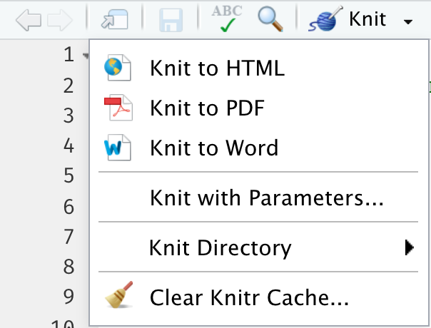

```{r setup, include=FALSE}
library(knitr)
library(tidyverse)
library(fontawesome)
library(countdown)
library(metathis)
library(ymlthis)

options(
  htmltools.dir.version = FALSE,
  knitr.table.format = "html",
  knitr.kable.NA = '',
  dplyr.width = Inf,
  width = 250
)

knitr::opts_chunk$set(
  cache = FALSE,
  warning = FALSE,
  message = FALSE,
  fig.path = "figs/",
  fig.width = 7.252,
  fig.height = 4,
  comment = "#>",
  fig.retina = 3
)

# Setup xaringanExtra options
xaringanExtra::use_xaringan_extra(c(
  "tile_view", "panelset", "clipboard", "share_again"))
xaringanExtra::style_share_again(share_buttons = "none")
xaringanExtra::use_extra_styles(
  hover_code_line = TRUE,
  mute_unhighlighted_code = FALSE
)

# Set up website metadata
meta() %>%
  meta_general(
    description = rmarkdown::metadata$subtitle,
    generator = "xaringan and remark.js"
  ) %>%
  meta_name("github-repo" = "emse-madd-gwu/2021-Fall") %>%
  meta_social(
    title = rmarkdown::metadata$title,
    url = "https://madd.seas.gwu.edu/2021-Fall/",
    og_type = "website",
    og_author = "John Paul Helveston",
    twitter_card_type = "summary_large_image",
    twitter_creator = "@johnhelveston"
  )

# Setup class-specific paths
class <- rmarkdown::metadata$class
root <- paste0("https://madd.seas.gwu.edu/2021-Fall/class/", class, "/")
path_slides <- file.path("class", class, "index.html")
path_pdf <- paste0(root, class, ".pdf")
path_notes <- paste0(root, class, ".zip")

# For this class
data <- mtcars
bears <- read_csv(here::here('data', 'bear_killings.csv'))
theme_set(theme_gray(base_size = 16))
```

class: middle, inverse

.leftcol30[
<center>

</center>
]

.rightcol70[
# Week `r rmarkdown::metadata$week`: .fancy[`r rmarkdown::metadata$title`]

### `r fontawesome::fa(name = "university", fill = "white")` `r rmarkdown::metadata$subtitle`
### `r fontawesome::fa(name = "user", fill = "white")` `r rmarkdown::metadata$author`
### `r fontawesome::fa(name = "calendar-alt", fill = "white")` `r rmarkdown::metadata$date`
]

---

class: inverse

# Quiz 1

```{r, echo=FALSE}
countdown(minutes = 10,
          warn_when = 30,
          update_every = 1,
          bottom = 0,
          left = 0,
          font_size = '4em')
```

.leftcol[
### Link is on the [schedule](https://madd.seas.gwu.edu/2021-Fall/schedule.html)

### Make sure to download the zip file on the first page!
]

.rightcol[
<center>

</center>
]

---

```{r child="topics/0.Rmd"}
```

---

```{r child="topics/1.Rmd"}
```

---

class: center

# "Literate programming"

.leftcol[.left[
> ### Treat programs as a "literature" understandable to **human beings**
]]

.rightcol[.center[

<center>

</center>

[Donald E. Knuth](https://en.wikipedia.org/wiki/Donald_Knuth)
]]

---

background-image: url(images/horst_monsters_rmarkdown.png)
background-size: contain
background-color: #FFFFFF

.footnote[Art by [Allison Horst](https://twitter.com/allison_horst?lang=en)]

---

# .center[Anatomy of a .Rmd file]

<br>

# YAML (**Y**et **A**nother **M**arkdown **L**anguage)

# Markdown text

# R code

---

class: center, middle, inverse 

# Quick demo

# Open `rmd_demo.Rmd`, then click "knit"

---

# Define overall document options in YAML

.leftcol[
Basic html page
```{r, echo = FALSE}
yml_empty() %>%
  yml_title("Your title here") %>%
  yml_author("Your name here") %>%
  yml_output(html_document()) %>%
  asis_yaml_output()
```
]

.rightcol[
Add table of contents, change theme
```{r, echo = FALSE}
yml_empty() %>%
  yml_title("Your title here") %>%
  yml_author("Your name here") %>%
  yml_output(html_document(toc = TRUE,
                           toc_float = TRUE,
                           theme = "flatly")) %>%
  asis_yaml_output()
```

Other themes at https://bootswatch.com/
]

---

# `r emo::ji("yarn")` Knit to multiple outputs

```{r, eval=FALSE}
rmarkdown::render("rmd_demo.Rmd", output_format = "all")
```

.leftcol[
```{r echo=FALSE, out.width="60%", fig.align="center"}

```

]

.rightcol[
```{r echo=FALSE}
yml_empty() %>%
  yml_title("Your title here") %>%
  yml_author("Your name here") %>%
  yml_output(html_document(toc = TRUE, toc_float = TRUE, theme = "flatly"),
             word_document(),
             pdf_document()
             )  %>%
  asis_yaml_output()
```
]

---

# .center[Anatomy of a .Rmd file]

<br>

# ~~YAML (**Y**et **A**nother **M**arkdown **L**anguage)~~

# .red[Markdown text]

# R code

---

class: center

# Right now, bookmark this! `r emo::ji("point_down")`

# https://commonmark.org/help/

<br><hr><br>

# (When you have 10 minutes, do this! `r emo::ji("point_down")`)

# https://commonmark.org/help/tutorial/

---

# .center[Headers]

--

.leftcol[
```markdown
# HEADER 1

## HEADER 2

### HEADER 3

#### HEADER 4

##### HEADER 5

###### HEADER 6
```
]

--

.rightcol[
# HEADER 1

## HEADER 2

### HEADER 3

#### HEADER 4

##### HEADER 5

###### HEADER 6
]

---

# .center[Basic Text Formatting]

.leftcol[
## Type this...

- `normal text`
- `_italic text_`
- `*italic text*`
- `**bold text**`
- `***bold italic text***`
- `~~strikethrough~~`
- `` `code text` ``
]

.rightcol[
## ..to get this

- normal text
- _italic text_
- *italic text*
- **bold text**
- ***bold italic text***
- ~~strikethrough~~
- `code text`
]

---
class: top

# .center[Lists]

.leftcol[

Bullet list:

```{r, eval=FALSE}
- first item
- second item
- third item
```

- first item
- second item
- third item
]

.rightcol[

Numbered list:

```{r, eval=FALSE}
1. first item
2. second item
3. third item
```

1. first item
2. second item
3. third item
]

---

# .center[Links]

Simple **url link** to another site:

```{r, eval=FALSE}
[Download R](http://www.r-project.org/)
```

[Download R](http://www.r-project.org/)

---

class: center, middle, inverse 

# Back to `rmd_demo.Rmd`

---

# .center[Anatomy of a .Rmd file]

<br>

# ~~YAML (**Y**et **A**nother **M**arkdown **L**anguage)~~

# ~~Markdown text~~

# .red[R code]

---
class: center

# R Code

--

.leftcol[

## Inline code

.left[
```{r, eval=FALSE}
`r insert code here`
```

]]

--

.rightcol[

## Code chunks

.left[
````markdown
`r ''````{r}
insert code here
insert more code here
```
````
]]

---

# Inline R code

```{r, eval=FALSE}
The sum of 3 and 4 is `r 3 + 4`
```

--

Produces this:

The sum of 3 and 4 is `r 3 + 4`

---

# R Code chunks

.leftcol[

This code chunk...

````markdown
`r ''````{r}
bears %>%
  count(month)
```
````
]

--

.rightcol[
...will produce this when compiled: 

```{r}
bears %>%
  count(month)
```
]

---

# Chunk options

Control what chunks output using options inside `{r}`:

Example: `{r, echo=FALSE, message=FALSE}`

```{r, echo=FALSE, out.width='60%'}
knitr::include_graphics('images/chunks_options.png')
```

---

# .center[Chunk output options]

.center[By default, code chunks print **code** + **output**]

--

.cols3[

````markdown
`r ''````{r, echo=FALSE}
cat('hello world!')
```
````

Prints only **output**<br>(doesn't show code)

```{r, echo=FALSE}
cat('hello world!')
```
]

--

.cols3[

````markdown
`r ''````{r, eval=FALSE}
cat('hello world!')
```
````

Prints only **code**<br>(doesn't run the code)

```{r, eval=FALSE}
cat('hello world!')
```
]
--
.cols3[

````markdown
`r ''````{r, include=FALSE}
cat('hello world!')
```
````

Runs, but doesn't print anything

```{r, include=FALSE}
cat('hello world!')
```
]

---

# message / warning


---

# message / warning

Drop messages and warnings in chunk settings

.leftcol[

````markdown
`r ''````{r, message=FALSE, warning=FALSE}
library(tidyverse)
```
````
]

---

# A global `setup` chunk `r emo::ji("earth_africa")`

One chunk to rule them all!

.leftcol[

````markdown
`r ''````{r setup, include = FALSE}
knitr::opts_chunk$set(
  warning = FALSE,
  message = FALSE,
  comment = "#>",
  fig.retina = 3,
  fig.path = "figs/"
)
```
````

]

.rightcol[

- A special chunk label: `setup`
- Typically the first chunk
- All following chunks will use these options (i.e., sets global chunk options)
- **Tip**: set `include=FALSE`
- You can (and should) use individual chunk options too

]

---

class: inverse

```{r, echo=FALSE}
countdown(minutes = 15,
          warn_when = 15,
          update_every = 1,
          top = 0,
          right = 0,
          font_size = '2em')
```

## Think Pair Share

.font90[
1) Open the `bears.Rmd` file, and title it _"Bears Analysis"_

2) Create a "setup" code chunk to read in the `bear_killings.csv` data file<br>(HINT: You might want to look back at the `rmd_demo.Rmd` file!).

3) Use text and code to find answers each of the following questions - show your code and results to justify each answer:

- Which months have the highest frequency of bear killings?
- Who has been killed more often by bears: hunters or hikers?
- How do the the number of bear attacks on men vs women compare?

HINT: Use `bears %>% count(variable)` to count how many rows are in the data for each unique value of `variable`
]

---

```{r child="topics/2.Rmd"}
```

---

.leftcol[

]

.rightcol[
# "Grammar of Graphics"

Concept developed by Leland Wilkinson (1999)

**ggplot2** package developed by Hadley Wickham (2005)
]

---

# Making plot layers with ggplot2

<br>

### 1. The data 
### 2. The aesthetic mapping (what goes on the axes?)
### 3. The geometries (points? bars? etc.)
### 4. The annotations / labels
### 5. The theme

---

# Layer 1: The data

```{r}
head(mpg)
```

---

# Layer 1: The data

The `ggplot()` function initializes the plot with whatever data you're using

.leftcol[
```{r ggblank, fig.show='hide'}
mpg %>% 
  ggplot()
```
]

.rightcol[.blackborder[
```{r ref.label='ggblank', echo=FALSE, fig.height=5, fig.width=7}
```
]]

---

# Layer 2: The aesthetic mapping

The `aes()` function determines which variables will be _mapped_ to the geometries<br>(e.g. the axes)

.leftcol[
```{r ggaes, fig.show='hide'}
mpg %>% 
  ggplot(aes(x = displ, y = hwy)) #<<
```
]

.rightcol[.blackborder[
```{r ref.label='ggaes', echo=FALSE, fig.height=5, fig.width=7}
```
]]

---

# Layer 3: The geometries

Use `+` to add geometries, e.g. `geom_points()` for points

.leftcol[
```{r ggpoint, fig.show='hide'}
mpg %>% 
  ggplot(aes(x = displ, y = hwy)) +
  geom_point() #<<
```
]

.rightcol[.blackborder[
```{r ref.label='ggpoint', echo=FALSE, fig.height=5, fig.width=7}
```
]]

---

# Layer 4: The annotations / labels

Use `labs()` to modify most labels

.leftcol[
```{r gglabs, fig.show='hide'}
mpg %>% 
  ggplot(aes(x = displ, y = hwy)) +
  geom_point() +
  labs( #<<
    x = "Engine displacement (liters)",  #<<
    y = "Highway fuel economy (mpg)",  #<<
    title = "Most larger engine vehicles are less fuel efficient" #<<
  ) #<<
```
]

.rightcol[.blackborder[
```{r ref.label='gglabs', echo=FALSE, fig.height=5, fig.width=7}
```
]]

---

# Layer 5: The theme

.leftcol[
```{r ggtheme_bw, fig.show='hide'}
mpg %>% 
  ggplot(aes(x = displ, y = hwy)) +
  geom_point() +
  labs(
    x = "Engine displacement (liters)",  
    y = "Highway fuel economy (mpg)", 
    title = "Most larger engine vehicles are less fuel efficient"
  ) + 
  theme_bw() #<<
```
]

.rightcol[.blackborder[
```{r ref.label='ggtheme_bw', echo=FALSE, fig.height=5, fig.width=7}
```
]]

---

### Common themes

.leftcol[
`theme_bw()`
```{r, fig.height=4, fig.width=6}
mpg %>% 
  ggplot(aes(x = displ, y = hwy)) +
  geom_point() +
  theme_bw() #<<
```
]

.rightcol[
`theme_minimal()`
```{r, fig.height=4, fig.width=6}
mpg %>% 
  ggplot(aes(x = displ, y = hwy)) +
  geom_point() +
  theme_minimal() #<<
```
]

---

### Common themes

.leftcol[
`theme_classic()`
```{r, fig.height=4, fig.width=6}
mpg %>% 
  ggplot(aes(x = displ, y = hwy)) +
  geom_point() +
  theme_classic() #<<
```
]

.rightcol[
`theme_void()`
```{r, fig.height=4, fig.width=6}
mpg %>% 
  ggplot(aes(x = displ, y = hwy)) +
  geom_point() +
  theme_void() #<<
```
]

---

### Other themes: [hrbrthemes](https://github.com/hrbrmstr/hrbrthemes)

```{r, eval=FALSE}
remotes::install_github("hrbrmstr/hrbrthemes")
```

.leftcol[
```{r, fig.height=4, fig.width=6}
mpg %>% 
  ggplot(aes(x = displ, y = hwy)) +
  geom_point() +
  hrbrthemes::theme_ipsum() #<<
```
]

.rightcol[
```{r, fig.height=4, fig.width=6}
mpg %>% 
  ggplot(aes(x = displ, y = hwy)) +
  geom_point() +
  hrbrthemes::theme_ft_rc() #<<
```
]

---

### Other themes: [ggthemes](https://jrnold.github.io/ggthemes/)

```{r, eval=FALSE}
install.packages('ggthemes', dependencies = TRUE)
```

.leftcol[
```{r, fig.height=4, fig.width=6}
mpg %>% 
  ggplot(aes(x = displ, y = hwy)) +
  geom_point() +
  ggthemes::theme_economist() #<<
```
]

.rightcol[
```{r, fig.height=4, fig.width=6}
mpg %>% 
  ggplot(aes(x = displ, y = hwy)) +
  geom_point() +
  ggthemes::theme_economist_white() #<<
```
]

---

class: center, middle, inverse 

# More practice

# Open `ggplot2.Rmd`

---

class: inverse

.leftcol[
```{r, echo=FALSE}
mpg %>% 
  ggplot() +
  geom_smooth(aes(x = displ, y = hwy, color = drv))
```

```{r, echo=FALSE}
mpg %>% 
  count(class, drv) %>% 
  ggplot() +
  geom_col(aes(x = drv, y = n, fill = class), width = 0.7)
```
]

.rightcol[
```{r, echo=FALSE}
countdown(minutes = 15,
          warn_when = 15,
          update_every = 1,
          top = 0,
          right = 0,
          font_size = '2em')
```

## Think Pair Share

Use the `mpg` data frame and ggplot to create these charts

```{r, echo=FALSE}
mpg %>% 
  ggplot(aes(x = displ, y = hwy)) +
  geom_point(aes(color = class)) + 
  geom_smooth(se = FALSE)
```
]

---

class: inverse, center

# .fancy[Break]

```{r, echo=FALSE}
countdown(minutes = 5,
          warn_when = 30,
          update_every = 1,
          left = 0, right = 0, top = 1, bottom = 0,
          margin = "5%",
          font_size = "8em")
```

---

class: inverse

# Extra practice

.leftcol[
```{r, ggbar_p1, echo=FALSE, fig.height=5, fig.width=7}
bears %>%
  count(year, gender) %>%
  ggplot() +
  geom_col(aes(x = year, y = n, fill = gender)) +
  labs(
    x     = "Year",
    y     = 'Number of killings',
    fill  = "Victim gender",
    title = "Annual deadly bear attacks over time"
  ) +
  theme_bw()
```
]

.rightcol[
```{r, fig.height=4, fig.width=6, echo=FALSE}
mpg %>%
    mutate(manufacturer = str_to_title(manufacturer)) %>%
    group_by(manufacturer) %>%
    summarise(mean_hwy = mean(hwy)) %>%
    ggplot() +
    geom_col(
      aes(x = mean_hwy, y = reorder(manufacturer, mean_hwy)), 
      width = 0.9) +
    labs(
      x = 'Highway fuel economy (mpg)',
      y = 'Vehicle manufacturer', 
      title = 'Mean fuel economy by automaker'
    ) + 
    theme_minimal()
```
]

---

```{r child="topics/3.Rmd"}
```

---

class: center

# Model Relationships Table ([example](https://docs.google.com/spreadsheets/d/1iwMI9cbJjB6J8wghZY6Y_fCOSt7MDsUTnSuuC58_xjU/edit?usp=sharing))

.border[
<center>

</center>
]

## Start defining attribute _levels_

---

# Defining attribute levels

.leftcol[
## Continuous

- **Price**: 1, 2, 3, 4, 5 ($)
- **Power Output**: 60, 80, 120 (Watts)

## Discrete

- **Color**: Red, Blue, Yellow
- **Material**: Plastic, Aluminum, Glass
]

.rightcol[
- Look at competitors
- Search web for values that cover the full set of values available today (and maybe some into the future)

]
