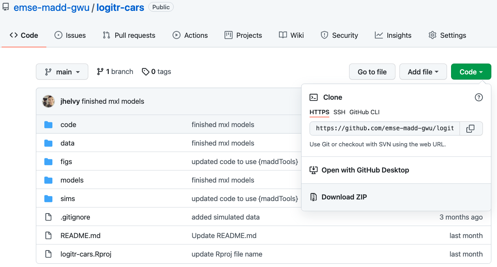
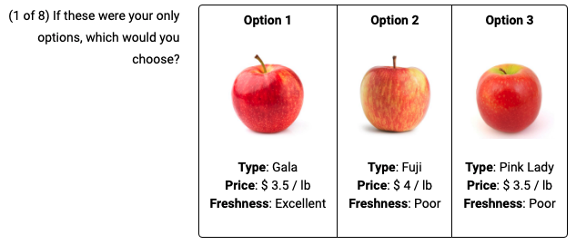

```{r setup, include=FALSE}
library(knitr)
library(tidyverse)
library(fontawesome)
library(countdown)
library(metathis)

options(
  htmltools.dir.version = FALSE,
  knitr.table.format = "html",
  knitr.kable.NA = '',
  dplyr.width = Inf,
  width = 250
)

knitr::opts_chunk$set(
  cache = FALSE,
  warning = FALSE,
  message = FALSE,
  fig.path = "figs/",
  fig.width = 7.252,
  fig.height = 4,
  comment = "#>",
  fig.retina = 3
)

# Setup xaringanExtra options
xaringanExtra::use_xaringan_extra(c(
  "tile_view", "panelset", "clipboard", "share_again"))
xaringanExtra::style_share_again(share_buttons = "none")
xaringanExtra::use_extra_styles(
  hover_code_line = TRUE,
  mute_unhighlighted_code = FALSE
)

# Set up website metadata
meta() %>%
  meta_general(
    description = rmarkdown::metadata$subtitle,
    generator = "xaringan and remark.js"
  ) %>%
  meta_name("github-repo" = "emse-madd-gwu/2021-Fall") %>%
  meta_social(
    title = rmarkdown::metadata$title,
    url = "https://madd.seas.gwu.edu/2021-Fall/",
    og_type = "website",
    og_author = "John Paul Helveston",
    twitter_card_type = "summary_large_image",
    twitter_creator = "@johnhelveston"
  )

# Setup class-specific paths
class <- rmarkdown::metadata$class
root <- paste0("https://madd.seas.gwu.edu/2021-Fall/class/", class, "/")
path_slides <- file.path("class", class, "index.html")
path_pdf <- paste0(root, class, ".pdf")
path_notes <- paste0(root, class, ".zip")
```

```{r, include=FALSE}
# make surveys
library(conjointTools)
levels <- list(
  price       = c(15, 20, 25), # Price ($1,000)
  fuelEconomy = c(20, 25, 30),   # Fuel economy (mpg)
  accelTime   = c(6, 7, 8),      # 0-60 mph acceleration time (s)
  powertrain  = c("Gasoline", "Electric")
)
doe <- makeDoe(levels)
doe <- recodeDesign(doe, levels)
survey <- makeSurvey(
    doe       = doe,  # Design of experiment
    nResp     = 1000, # Total number of respondents (upper bound)
    nAltsPerQ = 3,    # Number of alternatives per question
    nQPerResp = 8     # Number of questions per respondent
)
survey_labeled <- makeSurvey(
    doe       = doe,  
    nResp     = 1000,
    nAltsPerQ = 3,  
    nQPerResp = 8,
    group     = "powertrain"
)
survey_og <- makeSurvey(
    doe       = doe,  
    nResp     = 1000, 
    nAltsPerQ = 3,  
    nQPerResp = 8,
    outsideGood = TRUE
)
survey_short <- survey %>% 
  mutate(
    price = scales::dollar(price),
    fuelEconomy = paste0(fuelEconomy, " (mpg)"),
    accelTime = paste0(accelTime, " (s)")
  ) %>% 
  select(
    respID, qID,
    `Option:` = altID, 
    `Price:` = price, 
    `Fuel Economy:` = fuelEconomy, 
    `Accel. Time:` = accelTime, 
    `Powertrain:` = powertrain
  )
survey_labeled_short <- survey_labeled %>% 
  mutate(
    price = scales::dollar(price),
    fuelEconomy = paste0(fuelEconomy, " (mpg)"),
    accelTime = paste0(accelTime, " (s)")
  ) %>% 
  select(
    respID, qID,
    `Option:` = powertrain, 
    `Price:` = price, 
    `Fuel Economy:` = fuelEconomy, 
    `Accel. Time:` = accelTime
  )
survey_og_short <- survey_og %>% 
  mutate(
    price = scales::dollar(price),
    fuelEconomy = paste0(fuelEconomy, " (mpg)"),
    accelTime = paste0(accelTime, " (s)"),
    price = ifelse(altID == 4, "", price),
    fuelEconomy = ifelse(altID == 4, "", fuelEconomy),
    accelTime = ifelse(altID == 4, "", accelTime),
    powertrain = ifelse(powertrain_Electric == 1, "Electric", "Gasoline"),
    powertrain = ifelse(altID == 4, "", powertrain),
    altID = ifelse(altID == 4, "None", altID)
  ) %>% 
  select(
    respID, qID,
    `Option:` = altID, 
    `Price:` = price, 
    `Fuel Economy:` = fuelEconomy, 
    `Accel. Time:` = accelTime, 
    `Powertrain:` = powertrain
  )
row.names(survey_og_short) <- seq(nrow(survey_og_short))
survey_q1 <- survey_short %>% 
  filter(respID == 1, qID == 1) %>% 
  select(-respID, -qID)
survey_q2 <- survey_short %>% 
  filter(respID == 1, qID == 2) %>% 
  select(-respID, -qID)
survey_labeled_q1 <- survey_labeled_short %>% 
  filter(respID == 1, qID == 1) %>% 
  select(-respID, -qID)
survey_labeled_q2 <- survey_labeled_short %>% 
  filter(respID == 1, qID == 2) %>% 
  select(-respID, -qID)
survey_og_q1 <- survey_og_short %>% 
  filter(respID == 1, qID == 1) %>% 
  select(-respID, -qID)
survey_og_q2 <- survey_og_short %>% 
  filter(respID == 1, qID == 2) %>% 
  select(-respID, -qID)
```

class: middle, inverse

.leftcol30[
<center>

</center>
]

.rightcol70[
# Week `r rmarkdown::metadata$week`: .fancy[`r rmarkdown::metadata$title`]

### `r fontawesome::fa(name = "university", fill = "white")` `r rmarkdown::metadata$subtitle`
### `r fontawesome::fa(name = "user", fill = "white")` `r rmarkdown::metadata$author`
### `r fontawesome::fa(name = "calendar-alt", fill = "white")` `r rmarkdown::metadata$date`
]

---

class: inverse

# Quiz 2

```{r, echo=FALSE}
countdown(minutes = 10,
          warn_when = 30,
          update_every = 1,
          bottom = 0,
          left = 0,
          font_size = '4em')
```

.leftcol[
### Link is on the [schedule](https://madd.seas.gwu.edu/2021-Fall/schedule.html)

### Make sure to download the zip file on the first page!
]

.rightcol[
<center>

</center>
]

---

# Upcoming events

- **Society of Women Engineers (SWE) Conference Boot Camp**:<br>Friday, October 8, 4-5:30 p.m.

- **Virtual Media, Journalism, & Public Affairs Fair**:<br>Oct. 19  Time: 4:30 p.m. - 6 p.m.

- **Fundamentals of Engineering (FE) Exam Prep Workshop**:<br>November 1, 4-5:30 p.m.

- **Virtual Government & Nonprofit Fair**:<br>Nov. 19 Time: 1 p.m. - 4 p.m.

---

class: inverse, middle, center

# Some RMarkdown tips

---

### .center[Convert a data frame to a markdown table with `kable()`]

--

```{r, eval=FALSE}
library(tidyverse)

mtcars %>% 
  kable()
```

--

.font80[
```{r, echo=FALSE}
mtcars %>% 
  kable()
```
]

---

### .center[Example from team Omao (cups)]

```{r, eval=FALSE}
library(tidyverse)
library(here)

df <- read_csv(here("data", "competitors.csv"))
df %>% 
  kable()
```

.font80[
```{r, echo=FALSE}
library(tidyverse)
library(here)

df <- read_csv(here("data", "competitors.csv"))
df %>% 
  kable()
```
]

---

class: center, middle 

# More `kable()` formatting options:<br>[{kableExtra} package](https://cran.r-project.org/web/packages/kableExtra/vignettes/awesome_table_in_html.html)

---

# References

**Simple approach**: Insert a footnote with `^[]` 

### markdown

`The Eiffel Tower is 324 meters tall^[From the [Eiffel Tower wikipedia page](https://en.wikipedia.org/wiki/Eiffel_Tower)]`

### render

The Eiffel Tower is 324 meters tall<sup>1</sup>

.font70[<sup>1</sup>From the [Eiffel Tower wikipedia page](https://en.wikipedia.org/wiki/Eiffel_Tower)]

---

# References

**Complex (but more complete) approach**: Use bibtex 

https://bookdown.org/yihui/rmarkdown-cookbook/bibliography.html

You can insert citations with `[@citekey]`, and a "References" table will be automatically created.

--

<br>

**Footnotes are perfectly fine for this class**

---

```{r child="topics/0.Rmd"}
```

---

```{r child="topics/1.Rmd"}
```

---

class: center 

## Download the [logitr-cars](https://github.com/emse-madd-gwu/logitr-cars) repo from GitHub

<center>

</center>

---

## .center[We'll be using the [{conjontTools} package](https://jhelvy.github.io/conjointTools/) today]

```{r, eval=FALSE}
install.packages("remotes")
remotes::install_github("jhelvy/conjointTools")
```

---

# Choice question components

### 1. Define the attributes and levels 

### 2. Define a "design of experiment" data frame

### 3. Define a "survey" data frame

???

(A list of every attribute and level in your survey)

(A data frame of all possible combinations of every attribute & level)

(Randomly assigned questions drawn from the design of experiment)

--

<br>

# Open `logitr-cars.Rproj`

---

class: center 

# Basic survey

Any combination of attributes can be shown in each choice question

.leftcol[.font90[
## Question 1
```{r, echo=FALSE}
kable(t(survey_q1))
```
]]

.rightcol[.font90[
## Question 2
```{r, echo=FALSE}
kable(t(survey_q2))
```
]]

---

class: center 

# Labeled survey

One attribute is used as the "label" - choice options are fixed according to the label

.leftcol[.font90[
## Question 1
```{r, echo=FALSE}
kable(t(survey_labeled_q1))
```
]]

.rightcol[.font90[
## Question 2
```{r, echo=FALSE}
kable(t(survey_labeled_q2))
```
]]

---

class: center 

# Survey with an "Outside Good"

An "outside good" means they can choose an "other" option (usually "None") 

.leftcol[.font90[
## Question 1
```{r, echo=FALSE}
kable(t(survey_og_q1))
```
]]

.rightcol[.font90[
## Question 2
```{r, echo=FALSE}
kable(t(survey_og_q2))
```
]]

---

# Attribute-specific features

Some attributes may only be valid for certain levels of other attributes

> **Example**: The driving range of an electric vehicle (EV) only applies to EVs and not gasoline-powered vehicles.

--

<br>

To implement this, set the attribute to `0` for the non-applicable cases

(do this _after_ using `makeSurvey()`)

---

class: inverse

```{r, echo=FALSE}
countdown(minutes = 20,
          warn_when = 15,
          update_every = 1,
          top = 0,
          right = 0,
          font_size = '2em')
```

## Your Turn

1. With your team, discuss the specific choice question design for your project

- Regular or labeled?
- Include a "none" option (outside good) or not?

2. Edit the `make_choice_questions.R` file to design your choice questions.

---

```{r child="topics/2.Rmd"}
```

---

# .center[Displaying your choice questions online]

### 1. Export your choice questions as a .csv file
### 2. Upload your .csv file somewhere
### 3. Use R code to extract the values to display 
### 4. Use RMarkdown to display the values

---

### 1. Export your choice questions as a .csv file

```{r, eval=FALSE}
write_csv(survey, here('choice_questions.csv'))
```

--

### 2. Upload your .csv file somewhere

.leftcol[.center[
### Inside a formr run (private)

<center>

</center>
]]

.rightcol[.center[
### github.com (public)

.font200[[`r fa("github")`](https://github.com/)]

[apples example](https://github.com/jhelvy/formr4conjoint)
]]

---

## .center[Use R code to extract the values to display]

### - Read `choice_questions.csv` from web
### - Randomly choose a respondent ID
### - Filter rows for that respondent ID
### - Serialize the data frame to json format

---

# .center[Side note on serializing a data frame]

.center[Converts a data frame to one long string]

```{r, echo=FALSE}
df <- survey %>% 
  filter(obsID == 1) %>% 
  select(-respID, -qID, -obsID)
```
```{r}
df
```

```{r}
df_json <- jsonlite::toJSON(df)
df_json
```

---

# .center[Use RMarkdown to display the values]

.leftcol[
Create separate data frames for each alternative

```{r}
library(dplyr)
alts <- jsonlite::fromJSON(df_json)
alt1 <- alts %>% filter(altID == 1)
alt2 <- alts %>% filter(altID == 2)
alt3 <- alts %>% filter(altID == 3)
```
]

--

.rightcol[
Use RMarkdown formatting to display content in each alternative

```{r, eval=FALSE}
***Option 1**

***Price**: $ `r alt1$price`
***Powertrain**: $ `r alt1$powertrain`
***Fuel Economy**: `r alt1$fuelEconomy` mpg
***0-60 Accel. Time**: `r alt1$accelTime` s
```

**Option 1**

**Price**: $ `r alt1$price`<br>
**Powertrain**: $ `r alt1$powertrain`<br>
**Fuel Economy**: `r alt1$fuelEconomy` mpg<br>
**0-60 Accel. Time**: `r alt1$accelTime` s
]

---

## .center[Show options in a table with `kable()`]

.leftcol[
```{r}
library(dplyr)
alts <- jsonlite::fromJSON(df_json) %>%
  # Add units to attributes
  mutate(
    price = scales::dollar(price),
    fuelEconomy = paste(fuelEconomy, "(mpg)"),
    accelTime = paste(accelTime, "(s)")) %>% 
  # Make nicer attribute labels
  select(
    `Option:` = altID, 
    `Powertrain:` = powertrain,
    `Price:` = price, 
    `Fuel Economy:` = fuelEconomy, 
    `Accel. Time:` = accelTime)

# Drop row names
row.names(alts) <- NULL
```
]

.rightcol[
Display the _transpose_, `t(alts)`
```{r}
kable(t(alts))
```
]

---

class: center 

## Download the [formr4conjoint](https://github.com/jhelvy/formr4conjoint) repo from GitHub

(code used in the related [blog post](https://www.jhelvy.com/posts/2021-09-18-choice-based-conjoint-surveys-in-r-with-formr/))

<center>

</center>

---

class: inverse

```{r, echo=FALSE}
countdown(minutes = 20,
          warn_when = 15,
          update_every = 1,
          top = 0,
          right = 0,
          font_size = '2em')
```

## Your Turn

.leftcol80[
1. With your team, upload your `choice_questions.csv` file somewhere online, like inside a formr run or on a github repo.
2. Edit the `p2-choice-questions.Rmd` or `p2-choice-questions-table.Rmd` file to implement your choice questions in RMarkdown. 

You should be able to knit the file to visually test how one of your choice questions is rendering. 
]

---

```{r child="topics/3.Rmd"}
```

---

# Your first few rows

<br>

### - Read `choice_questions.csv` from web
### - Randomly choose a respondent ID
### - Filter rows for that respondent ID
### - Serialize the data frame to json format

---

### Using the `calculate` type ([example sheet](https://docs.google.com/spreadsheets/d/1Ih3Pt6uz-gp5vc0SBxBzl4K0aZoRLwI6dtdtZiXSLz0/edit#gid=1611481919))

.leftcol[
RMarkdown
```{r, eval=FALSE}
# Read in the choice questions
library(tidyverse)
survey <- read_csv("https://raw.githubusercontent.com/jhelvy/formr4conjoint/master/survey/choice_questions.csv")

# Define the respondent ID
respondentID <- sample(survey$respID, 1)

# Create the subset of rows for that respondent ID
df <- survey %>%
    filter(respID == respondentID) %>%
    mutate(image = paste0("https://raw.githubusercontent.com/jhelvy/formr4conjoint/master/survey/images/", image))

# Convert df to json
df_json <- jsonlite::toJSON(df)
```
]

.rightcol[
Google sheet
<center>

</center>
]

---

## Random choice questions as buttons ([example sheet](https://docs.google.com/spreadsheets/d/1Ih3Pt6uz-gp5vc0SBxBzl4K0aZoRLwI6dtdtZiXSLz0/edit#gid=1611481919))

Use the `mc_button` question type

.leftcol[
### `label`

- Show your question text
- Insert a code chunk to create one-row data frame for each alternative

### `choice` columns

- Insert RMarkdown code to display each alternative
]

.rightcol[
<center>

</center>
]

---

## Random choice questions as table ([example sheet](https://docs.google.com/spreadsheets/d/1EG14Eh9kDBvE_iETfm6l6g90mrQ5sl_zbWaXkwIOGLU))

- Use the `mc_button` question type

.leftcol[
### `label`

- Show your question text
- Insert a code chunk to modify `alts` data frame & display it using `kable()`
- Use [kableExtra](https://haozhu233.github.io/kableExtra/awesome_table_in_html.html#Basic_HTML_table) to control table styling

### `choice` columns

- Simple text / number for each option
]

.rightcol[
<center>

</center>
]

---

class: inverse

## Your Turn

1. Discuss the layout you would prefer to implement for your choice questions (buttons or table). 

2. Make a Google Sheet using your team Google account to start implementing your conjoint questions.

.leftcol[.center[
## [buttons example sheet](https://docs.google.com/spreadsheets/d/1Ih3Pt6uz-gp5vc0SBxBzl4K0aZoRLwI6dtdtZiXSLz0/edit#gid=1611481919)
]]

.rightcol[.center[
## [table example sheet](https://docs.google.com/spreadsheets/d/1EG14Eh9kDBvE_iETfm6l6g90mrQ5sl_zbWaXkwIOGLU)
]]


