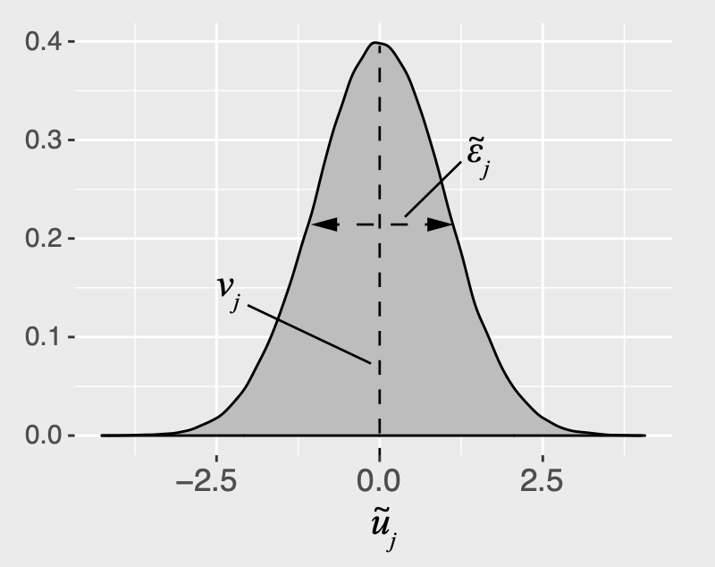

```{r setup, include=FALSE}
library(knitr)
library(tidyverse)
library(fontawesome)
library(kableExtra)
library(countdown)
library(metathis)
library(here)

options(
  htmltools.dir.version = FALSE,
  knitr.table.format = "html",
  knitr.kable.NA = '',
  dplyr.width = Inf,
  width = 250
)

knitr::opts_chunk$set(
  cache = FALSE,
  warning = FALSE,
  message = FALSE,
  fig.path = "figs/",
  fig.width = 7.252,
  fig.height = 4,
  comment = "#>",
  fig.retina = 3
)

# Setup xaringanExtra options
xaringanExtra::use_xaringan_extra(c(
  "tile_view", "panelset", "share_again"))
xaringanExtra::style_share_again(share_buttons = "none")
xaringanExtra::use_extra_styles(
  hover_code_line = TRUE,
  mute_unhighlighted_code = FALSE
)

# Set up website metadata
meta() %>%
  meta_general(
    description = rmarkdown::metadata$subtitle,
    generator = "xaringan and remark.js"
  ) %>%
  meta_name("github-repo" = "emse-madd-gwu/2021-Fall") %>%
  meta_social(
    title = rmarkdown::metadata$title,
    url = "https://madd.seas.gwu.edu/2021-Fall/",
    og_type = "website",
    og_author = "John Paul Helveston",
    twitter_card_type = "summary_large_image",
    twitter_creator = "@johnhelveston"
  )

# Setup class-specific paths
class <- rmarkdown::metadata$class
root <- paste0("https://madd.seas.gwu.edu/2021-Fall/class/", class, "/")
path_slides <- file.path("class", class, "index.html")
path_pdf <- paste0(root, class, ".pdf")
path_notes <- paste0(root, class, ".zip")
```

class: middle, inverse

.leftcol30[
<center>

</center>
]

.rightcol70[
# Week `r rmarkdown::metadata$week`: .fancy[`r rmarkdown::metadata$title`]

### `r fontawesome::fa(name = "university", fill = "white")` `r rmarkdown::metadata$subtitle`
### `r fontawesome::fa(name = "user", fill = "white")` `r rmarkdown::metadata$author`
### `r fontawesome::fa(name = "calendar-alt", fill = "white")` `r rmarkdown::metadata$date`
]

---

```{r child="topics/0.Rmd"}
```

---

```{r child="topics/1.Rmd"}
```

---

class: center 

# Random utility model 

<br>

## The utility for alternative $j$ is
# $$\tilde{u}_j = v_j + \tilde{\varepsilon}_j$$

--

## $v_j$ = Things we observe (non-random variables)
## $\tilde{\varepsilon}_j$ = Things we _don't_ observe (random variable)

---

class: center

# $$\tilde{u}_j = v_j + \tilde{\varepsilon}_j$$

<center>

</center>

---

class: inverse

# Practice Question 1

a) A random variable, $\tilde{x}$, has the PDF, $f_{\tilde{x}}(x)$. Write the equation to compute its total probability (hint: think area under the curve!). What is the answer to the equation?

--

b) A random variable, $\tilde{x}$, has a uniform distribution between the values 0 and 1. Draw the probability density function (PDF) and Cumulative Density Function (CDF) of $\tilde{x}$.

--

c) The value of a random variable, $\tilde{x}$, is determined by rolling one fair, 6-sided dice. Draw the PDF and CDF of $\tilde{x}$.

---

class: center

## **Logit model**: Assume that $\tilde{\varepsilon}_j$ ~ [Gumbel Distribution](https://en.wikipedia.org/wiki/Gumbel_distribution)

.leftcol[
## $$\tilde{u}_j = v_j + \tilde{\varepsilon}_j$$

<center>

</center>
]

--

.rightcol[
## Probability of choosing alternative $j$: 

# $$P_j = \frac{e^{v_j}}{\sum_k{e^{v_k}}}$$
]

---

class: inverse

# Practice Question 2

a) A consumer is making a choice between two bars of chocolate:

- Milk chocolate $(m)$
- Dark chocolate $(d)$

Assume that we know the observed utility of each bar to be $v_m = 3$ and $v_d = 4$. Using a logit model, compute the probabilities of choosing each bar: $P_m$ and $P_d$.

--

b) A third bar of chocolate is now added to the choice set. It is the exact same as the milk chocolate bar, but it has a slightly different wrapper (which has no effect on the consumer's utility). Now,  $v_{m1} = v_{m2} = 3$, and $v_d = 4$. Based on the probabilities from question a), what would we expect the probabilities of choosing each bar to be? What probabilities does the logit model produce?

---

class: center

### **"Observed utility" $(v_j)$ is a weighted sum of attribute values**

<br>

## $$v_j = \beta_1 x_{j}^{\mathrm{A}} + \beta_2 x_j^{\mathrm{B}} +  \dots$$

## Each $x_j$ is an observable attribute (_price_, etc.)

--

<br>

## We know $x_{j}^{\mathrm{A}}, x_{j}^{\mathrm{B}}, \dots$,<br>**we want to _estimate_** $\beta_1, \beta_2, \dots$

---

#.center[Notation Convention]

.leftcol[

## Continuous: $x_j$

## $$u_j = \beta_1 x_{j}^{\mathrm{price}} + \dots$$

```{r, echo=FALSE}
data.frame(price = c(1, 2, 3))
```
]

.rightcol[

## Discrete: $\delta_j$

## $$u_j = \beta_1 \delta_{j}^{\mathrm{ford}} + \beta_2 \delta_{j}^{\mathrm{gm}} \dots$$

```{r, echo=FALSE}
fastDummies::dummy_cols(data.frame(brand = c("Ford", "GM", "BMW")))
```
]

---

class: inverse

# Practice Question 3

```{r, echo=FALSE}
tibble(
  Attribute = c("Price", "% Cacao"),
  `Bar 1` = c("$1.20", "10%"),
  `Bar 2` = c("$1.50", "60%"),
  `Bar 3` = c("$3.00", "80%"),
) %>%
  kable()
```

a) Write out a model for the _observed_ utility of each chocolate bar in the above set.

--

b) If the coefficient for the _price_ attribute was -0.1 and the coefficient for % _Cacao_ attribute was 0.1, what is the difference in the observed utility between bars 3 and 1?

--

.leftcol[
c) With the addition of the _brand_ attribute, repeat part a.
]

.rightcol[
```{r, echo=FALSE}
tibble(
  Attribute = c("Price", "% Cacao", "Brand"),
  `Bar 1` = c("$1.20", "10%", "Hershey"),
  `Bar 2` = c("$1.50", "60%", "Lindt"),
  `Bar 3` = c("$3.00", "80%", "Ghirardelli"),
) %>%
  kable() %>% 
  kable_styling(
      bootstrap_options = c("hover", "condensed"), 
      full_width = FALSE)
```
]

---

class: inverse

```{r, echo=FALSE}
countdown(minutes = 20,
          warn_when = 15,
          update_every = 1,
          top = 0,
          right = 0,
          font_size = '2em')
```

## Your Turn

.leftcol[

Let's say our utility function is:

.font80[$$v_j = \beta_1 x_j^{\mathrm{price}} + \beta_2 x_j^{\mathrm{cacao}} + \beta_3 \delta_j^{\mathrm{hershey}} + \beta_4 \delta_j^{\mathrm{lindt}}$$]

And we estimate the following coefficients:

Parameter | Coefficient 
----------|-----------
$\beta_1$ | -0.1
$\beta_2$ | 0.1
$\beta_3$ | -2.0
$\beta_4$ | -0.1
]

.rightcol[
a) What are the expected probabilities of choosing each of these bars using a logit model? 

```{r, echo=FALSE}
tibble(
  Attribute = c("Price", "% Cacao", "Brand"),
  `Bar 1` = c("$1.20", "10%", "Hershey"),
  `Bar 2` = c("$1.50", "60%", "Lindt"),
  `Bar 3` = c("$3.00", "80%", "Ghirardelli"),
) %>%
  kable() %>% 
  kable_styling(
      bootstrap_options = c("hover", "condensed"), 
      full_width = FALSE)
```


b) What price would Bar 2 have to be to get a 50% market share?
]

---

```{r child="topics/2.Rmd"}
```

---

class: center 

## Download the [logitr-cars](https://github.com/emse-madd-gwu/logitr-cars) repo from GitHub

<center>

</center>

---

# .center[Exploring choice data]

<br>

.rightcol80[
## 1. Open `logitr-cars.Rproj`

## 2. Open `code/2.1-explore-data.R`
]

---

```{r child="topics/3.Rmd"}
```

---

# .center[Dummy-coded variables]

.center[**Dummy coding**: 1 = "Yes", 0 = "No"]

--

.leftcol[
Data frame with one variable: _price_
```{r}
data <- data.frame(price = c(10, 20, 30))

data
```
]

--

.rightcol[
Add dummy columns for each price "level"
```{r}
library(fastDummies)

dummy_cols(data, "price")
```
]

---

.leftcol[

.center[
### Model _price_ as _continuous_

$v_j = \beta_1 x^\mathrm{price}$

]
```{r, eval=FALSE}
model <- logitr(
    data   = data,
    choice = "choice",
    obsID  = "obsID",
    pars   = "price"
)
```

<br>

Coef. | Interpretation
------|------------------
β1 | how utility changes with increasing _price_

]

--

.rightcol[

.center[
### .center[Model _price_ as _discrete_]

$v_j = \beta_1 \delta^\mathrm{price = 20} +  \beta_2 \delta^\mathrm{price = 30}$
]

```{r, eval=FALSE}
model <- logitr(
    data   = data,
    choice = "choice",
    obsID  = "obsID",
    pars   = c("price_20", "price_30")
)
```

.center[Reference level: _price=10_]

Coef. | Interpretation
------|------------------
β1 | utility for _price=20_ relative to _price=10_
β2 | utility for _price=30_ relative to _price=10_

]

---

# .center[Estimating utility models]

<br>

.rightcol80[
## 1. Open `logitr-cars.Rproj`

## 2. Open `code/3.1-model-mnl.R`
]

---

.leftcol[

# `mnl_dummy`

All dummy-code variables 
```{r, eval=FALSE}
pars = c(
  "price_20", "price_25",
  "fuelEconomy_25", "fuelEconomy_30",
  "accelTime_7", "accelTime_8",
  "powertrain_Electric")
```

Reference Levels:

- Price: 15
- Fuel Economy: 20
- Accel. Time: 6
- Powertrain: "Gasoline"
]

--

.rightcol[
# `mnl_linear`

All continuous (linear), except for `powertrain_Electric` 
```{r, eval=FALSE}
pars = c(
  'price', 'fuelEconomy', 'accelTime', 
  'powertrain_Electric')
```

Reference Levels:

- Powertrain: "Gasoline"
]

---

class: inverse

```{r, echo=FALSE}
countdown(minutes = 20,
          warn_when = 15,
          update_every = 1,
          top = 0,
          right = 0,
          font_size = '2em')
```

## Your Turn

1) Run the code chunk to read in the `data.csv` file in the "data" folder, which contains choice observations from chocolate bars with the following attributes:

.font80[
Attribute | Description 
----------|----------------------
`price` | Price in $
`percent_cacao` | % Cacao (how "dark" the chocolate is)
`crispy_rice` | 0 or 1 for if the bar contains crispy rice
`brand` | "Hershey", "Lindt", or "Ghirardelli"
]

2) Write code to estimate the following utility model<br>(HINT: you may need to make some dummy-coded variables!):

$$u_j = \beta_1 x_j^{\mathrm{price}} + \beta_2 x_j^{\mathrm{\%cacao}} + \beta_3 \delta_j^{\mathrm{crispy}} + \beta_4 \delta_j^{\mathrm{hershey}} + \beta_5 \delta_j^{\mathrm{lindt}} + \varepsilon_j$$

3) Write code to plot the change in utility for the _price_ attribute.

---

```{r child="topics/4.Rmd"}
```

---

## .center[Estimating utility models with an _Outside Good_]

<br>

.rightcol80[
## 1. Open `logitr-cars.Rproj`

## 2. Open `code/4.1-model-og.R`
]

---

```{r child="topics/5.Rmd"}
```

---

# .center[Simulating choice data]

.leftcol40[
.center[Random choices]

```{r, eval=FALSE}
data <- simulateChoices(
  survey, 
  altID = "altID",
  obsID = "obsID"
)
```

]

--

.rightcol60[
.center[Choices according to assumed model

.font80[
$v_j = -0.1 x_j^{\mathrm{price}} + 0.1 x_j^{\mathrm{fuelEconomy}} + 0.1 x_j^{\mathrm{accelTime}} -4 \delta_j^{\mathrm{electric}}$
]]

```{r, eval=FALSE}
data <- simulateChoices(
  survey, 
  altID = "altID",
  obsID = "obsID",
  pars = list(
    price = -0.1,
    fuelEconomy = 0.1, 
    accelTime = 0.1,
    powertrain_Electric = -4
  )
)
```
]

---

# .center[Estimate a choice model]

$$v_j = \beta_1 x_j^{\mathrm{price}} + \beta_2 x_j^{\mathrm{fuelEconomy}} + \beta_3 x_j^{\mathrm{accelTime}} + \beta_4 \delta_j^{\mathrm{electric}}$$

```{r, eval=FALSE}
model <- logitr(
  data   = data,
  choice = "choice",
  obsID  = "obsID",
  pars   = c("price", "fuelEconomy", "accelTime", "powertrain_Electric")
)
```

---

class: inverse

```{r, echo=FALSE}
countdown(minutes = 20,
          warn_when = 15,
          update_every = 1,
          top = 0,
          right = 0,
          font_size = '2em')
```

## Your Turn

### As a team: 

1. Go back to your code from last week where you created your choice questions.

2. Write out a utility model for your project.

3. Write code to simulate data according to your utility model - pick some fake parameter values.

4. Write code to estimate a model using your simulated data.
