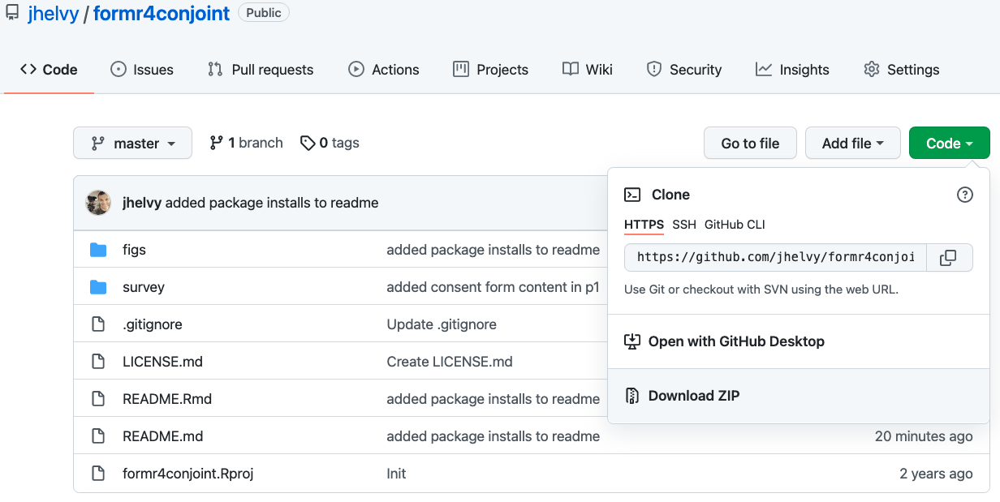

```{r setup, include=FALSE}
library(knitr)
library(fontawesome)
library(tidyverse)
library(countdown)
library(metathis)
library(lubridate)

options(
  htmltools.dir.version = FALSE,
  knitr.table.format = "html",
  knitr.kable.NA = '',
  dplyr.width = Inf,
  width = 250
)

knitr::opts_chunk$set(
  cache = FALSE,
  warning = FALSE,
  message = FALSE,
  fig.path = "figs/",
  fig.width = 7.252,
  fig.height = 4,
  comment = "#>",
  fig.retina = 3
)

# Setup xaringanExtra options
xaringanExtra::use_xaringan_extra(c(
  "tile_view", "panelset", "share_again"))
xaringanExtra::style_share_again(share_buttons = "none")
xaringanExtra::use_extra_styles(
  hover_code_line = TRUE,
  mute_unhighlighted_code = FALSE
)

# Set up website metadata
meta() %>%
  meta_general(
    description = rmarkdown::metadata$subtitle,
    generator = "xaringan and remark.js"
  ) %>%
  meta_name("github-repo" = "emse-madd-gwu/2021-Fall") %>%
  meta_social(
    title = rmarkdown::metadata$title,
    url = "https://madd.seas.gwu.edu/2021-Fall/",
    og_type = "website",
    og_author = "John Paul Helveston",
    twitter_card_type = "summary_large_image",
    twitter_creator = "@johnhelveston"
  )

# Setup class-specific paths
class <- rmarkdown::metadata$class
root <- paste0("https://madd.seas.gwu.edu/2021-Fall/class/", class, "/")
path_slides <- file.path("class", class, "index.html")
path_pdf <- paste0(root, class, ".pdf")
path_notes <- paste0(root, class, ".zip")

# Data for class 
abbs <- read_csv(here::here('data', 'state_abbs.csv'))
```

class: middle, inverse

.leftcol30[
<center>

</center>
]

.rightcol70[
# Week `r rmarkdown::metadata$week`: .fancy[`r rmarkdown::metadata$title`]

### `r fontawesome::fa(name = "university", fill = "white")` `r rmarkdown::metadata$subtitle`
### `r fontawesome::fa(name = "user", fill = "white")` `r rmarkdown::metadata$author`
### `r fontawesome::fa(name = "calendar-alt", fill = "white")` `r rmarkdown::metadata$date`
]

---

class: inverse

# Quiz 3

```{r, echo=FALSE}
countdown(minutes = 10,
          warn_when = 30,
          update_every = 1,
          bottom = 0,
          left = 0,
          font_size = '4em')
```

.leftcol[
### Make sure to download the zip file on the first page!
]

.rightcol[
<center>

</center>
]

---

```{r child="topics/0.Rmd"}
```

---

```{r child="topics/1.Rmd"}
```

---

## .center[Computing the likelihood]

.leftcol[
<center>

</center>
]

.rightcol[
$x$: an observation

$f(x)$: probability of observing $x$
]

---

## .center[Computing the likelihood]

.leftcol[
<center>

</center>
]

.rightcol[
$x$: an observation

$f(x)$: probability of observing $x$

$\mathcal{L}(\theta | x)$: probability that $\theta$ are the true parameters, given that observed $x$

**We want to estimate $\theta$**
]

---

class: center

## We actually compute the _log_-likelihood<br>(converts multiplication to addition)

<center>

</center>

---

class: inverse

# Practice Question 1

**Observations** - Height of students (inches):

```{r, echo=FALSE}
x <- c(65, 69, 66, 67, 68, 72, 68, 69, 63, 70)
x
```

a) Let's say we know that the height of students, $\tilde{x}$, in a classroom follows a normal distribution. A professor obtains the above height measurements students in her classroom. What is the log-likelihood that $\tilde{x} \sim \mathcal{N} (68, 4)$? In other words, compute $\ln \mathcal{L} (\mu = 68, \sigma = 4)$.

--

b) Compute the log-likelihood function using the same standard deviation $(\sigma = 4)$ but with the following different values for the mean, $\mu: 66, 67, 68, 69, 70$. How do the results compare? Which value for $\mu$ produces the highest log-likelihood?

---

```{r child="topics/2.Rmd"}
```

---

class: center, middle 

.leftcol40[
# $f(x)$
]

.rightcol60[
<center>

</center>
]

---

class: center, middle 

.leftcol40[
<center>

</center>
]

.rightcol60[
<center>

</center>
]


---

class: center, middle 

.leftcol40[
<center>

</center>
]

.rightcol60[
<center>

</center>
]

---

class: center, middle 

<center>

</center>

---

class: center, middle 

<center>

</center>

---

class: inverse

# Practice Question 2

.leftcol80[

Consider the following function:

$$f(x) = x^2 - 6x$$

The gradient is:

$$\nabla f(x) = 2x - 6$$

Using the starting point $x = 1$ and the step size $\gamma =  0.3$, apply the gradient descent method to compute the next **three** points in the search algorithm.
]

---

class: center, middle 

<center>

</center>

---

class: inverse

# Practice Question 3

.leftcol80[
Consider the following function:

$$
f(\underline{x}) = x_1^2 + 4x_2^2
$$

The gradient is:

$$
\nabla f(\underline{x}) =
\begin{bmatrix}
2x_1
\\
8x_2
\end{bmatrix}
$$

Using the starting point $\underline{x}_0 = [1, 1]$ and the step size $\gamma =  0.15$, apply the gradient descent method to compute the next **three** points in the search algorithm.
]

---

class: center

## Download the [logitr-cars](https://github.com/emse-madd-gwu/logitr-cars) repo from GitHub

<center>

</center>

---

# .center[Estimating utility models]

<br>

.rightcol80[
## 1. Open `logitr-cars.Rproj`

## 2. Open `code/3.1-model-mnl.R`
]

---

# Maximum likelihood estimation

.leftcol[
<center>

</center>
]

.rightcol[
<center>

</center>
]

---

class: inverse, center

# .fancy[Break]

```{r, echo=FALSE}
countdown(minutes = 5,
          warn_when = 30,
          update_every = 1,
          left = 0, right = 0, top = 1, bottom = 0,
          margin = "5%",
          font_size = "8em")
```

---

```{r child="topics/3.Rmd"}
```

---

class: center

## What's wrong with this map?

<center>

</center>

---

### Likely culprit: Merging two columns

.leftcol[
```{r, echo=FALSE}
names <- data.frame(state_name = sort(abbs$state_name))
abbs  <- data.frame(state_abb = sort(abbs$state_abb))
```
```{r}
head(names)
head(abbs)
```
]

--

.rightcol[
```{r}
result <- cbind(names, abbs)
head(result)
```
]

---

## Joins

1. `inner_join()`
2. `left_join()` / `right_join()`
3. `full_join()`

--

&zwj;Example: `band_members` & `band_instruments`

.leftcol[
```{r}
band_members
```
]

.rightcol[
```{r}
band_instruments
```
]

---

.leftcol[
## `inner_join()`

```{r}
band_members %>%
    inner_join(band_instruments)
```
]

.rightcol[
<br>
<center>

</center>
]

---

.leftcol[
## `full_join()`

```{r}
band_members %>%
    full_join(band_instruments)
```
]

.rightcol[
<br>
<center>

</center>
]

---

.leftcol[
## `left_join()`

```{r}
band_members %>%
    left_join(band_instruments)
```
]

.rightcol[
<br>
<center>

</center>
]

---

.leftcol[
## `right_join()`

```{r}
band_members %>%
    right_join(band_instruments)
```
]

.rightcol[
<br>
<center>

</center>
]

---

## Specify the joining variable name

.leftcol[
```{r, echo=TRUE, message=TRUE}
band_members %>%
    left_join(band_instruments)
```
]

--

.rightcol[
```{r, echo=TRUE, message=TRUE}
band_members %>%
    left_join(band_instruments,
              by = 'name') #<<
```
]

---

## Specify the joining variable name

If the names differ, use `by = c("left_name" = "joining_name")`

--

.leftcol[
```{r}
band_members
```
```{r}
band_instruments2
```
]

--

.rightcol[
```{r}
band_members %>%
    left_join(band_instruments2,
              by = c("name" = "artist")) #<<
```
]

---

## Specify the joining variable name

Or just rename the joining variable in a pipe

.leftcol[
```{r}
band_members
```
```{r}
band_instruments2
```
]

.rightcol[
```{r}
band_members %>%
    rename(artist = name) %>% #<<
    left_join(band_instruments2,
              by = "artist") #<<
```
]

---
class: inverse

```{r, echo=FALSE}
countdown(minutes = 15,
          warn_when = 30,
          update_every = 1,
          top = 0,
          right = 0,
          font_size = '2em')
```

## Your turn

.leftcol[
1. Write code to read in the `state_abbs.csv` and `state_regions.csv` data files in the "data" folder.
2. Create a new data frame called `states` by joining the two data frames `states_abbs` and `state_regions` together. The result should be a data frame with variables `region`, `name`, `abb`.
]

.rightcol[
Your result should look like this:

```{r, include=FALSE}
regions <- read_csv(here::here('data', 'state_regions.csv'))
abbs <- read_csv(here::here('data', 'state_abbs.csv'))
states <- regions %>%
    left_join(abbs, by = c('state' = 'state_name')) %>%
    select(region, name = state, abb = state_abb)
```
```{r}
head(states)
```
]

---

```{r child="topics/4.Rmd"}
```

---

class: center

## Download the [formr4conjoint](https://github.com/jhelvy/formr4conjoint) repo from GitHub

<center>

</center>

---

# .center[Cleaning formr survey data]

<br>

.rightcol80[
## 1. Open `formr4conjoint.Rproj`

## 2. Open `code/data_cleaning.R`
]

---

class: inverse

## Team time

.leftcol80[
### For the rest of class, work with your team mates to start importing and cleaning your pilot survey data
]
