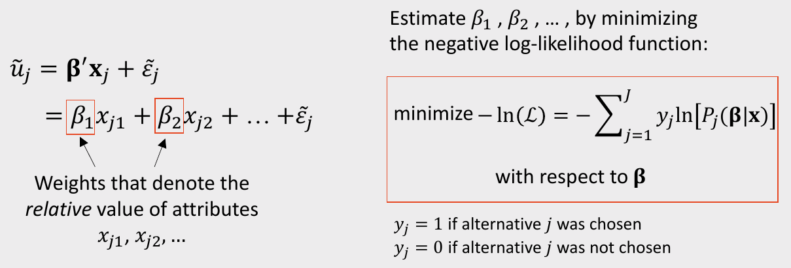
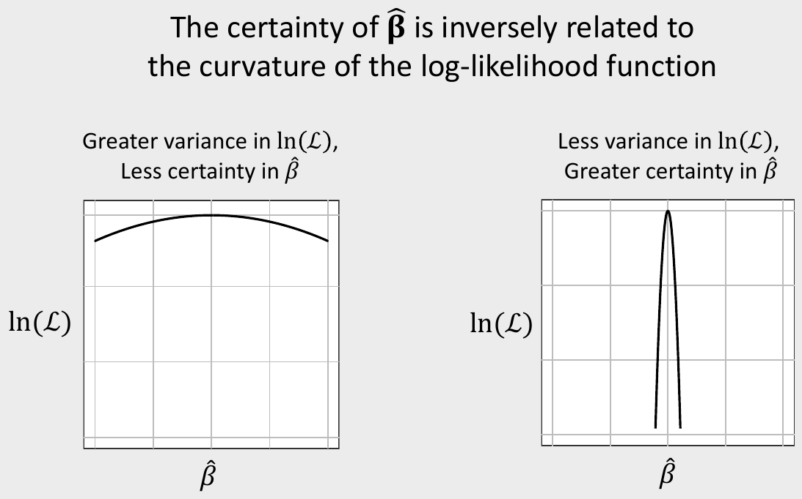
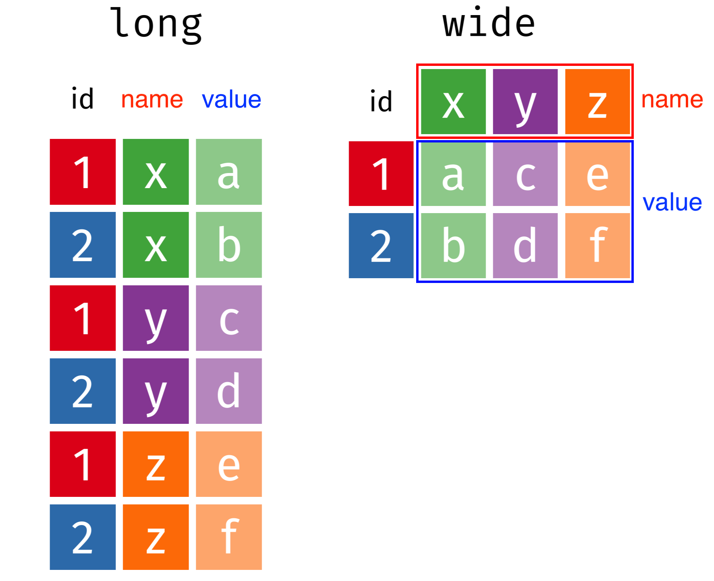

```{r setup, include=FALSE}
library(knitr)
library(tidyverse)
library(fontawesome)
library(kableExtra)
library(countdown)
library(metathis)
library(here)

options(
  htmltools.dir.version = FALSE,
  knitr.table.format = "html",
  knitr.kable.NA = '',
  dplyr.width = Inf,
  width = 250
)

knitr::opts_chunk$set(
  cache = FALSE,
  warning = FALSE,
  message = FALSE,
  fig.path = "figs/",
  fig.width = 7.252,
  fig.height = 4,
  comment = "#>",
  fig.retina = 3
)

# Setup xaringanExtra options
xaringanExtra::use_xaringan_extra(c(
  "tile_view", "panelset", "share_again"))
xaringanExtra::style_share_again(share_buttons = "none")
xaringanExtra::use_extra_styles(
  hover_code_line = TRUE,
  mute_unhighlighted_code = FALSE
)

# Set up website metadata
meta() %>%
  meta_general(
    description = rmarkdown::metadata$subtitle,
    generator = "xaringan and remark.js"
  ) %>%
  meta_name("github-repo" = "emse-madd-gwu/2021-Fall") %>%
  meta_social(
    title = rmarkdown::metadata$title,
    url = "https://madd.seas.gwu.edu/2021-Fall/",
    og_type = "website",
    og_author = "John Paul Helveston",
    twitter_card_type = "summary_large_image",
    twitter_creator = "@johnhelveston"
  )

# Setup class-specific paths
class <- rmarkdown::metadata$class
root <- paste0("https://madd.seas.gwu.edu/2021-Fall/class/", class, "/")
path_slides <- file.path("class", class, "index.html")
path_pdf <- paste0(root, class, ".pdf")
path_notes <- paste0(root, class, ".zip")

# Load data
milk_production  <- read_csv(here::here('data', 'milk_production.csv'))
fed_spend_long <- read_csv(here('data', 'fed_spend_long.csv'))
fed_spend_wide <- read_csv(here('data', 'fed_spend_wide.csv'))
tb_cases <- read_csv(here('data', 'tb_cases.csv'))
lotr_words <- read_csv(here('data', 'lotr_words.csv'))
```

class: middle, inverse

.leftcol30[
<center>

</center>
]

.rightcol70[
# Week `r rmarkdown::metadata$week`: .fancy[`r rmarkdown::metadata$title`]

### `r fontawesome::fa(name = "university", fill = "white")` `r rmarkdown::metadata$subtitle`
### `r fontawesome::fa(name = "user", fill = "white")` `r rmarkdown::metadata$author`
### `r fontawesome::fa(name = "calendar-alt", fill = "white")` `r rmarkdown::metadata$date`
]

---

# Quick correction from last week

**Observations** - Height of students (inches):

```{r, echo=FALSE}
x <- c(65, 69, 66, 67, 68, 72, 68, 69, 63, 70)
x
```

a) Let's say we know that the height of students, $\tilde{x}$, in a classroom follows a normal distribution. A professor obtains the above height measurements students in her classroom. What is the log-likelihood that $\tilde{x} \sim \mathcal{N} (68, 4)$? In other words, compute $\ln \mathcal{L} (\mu = 68, \sigma = 4)$.

--

b) Compute the log-likelihood function using the same standard deviation $(\sigma = 4)$ but with the following different values for the mean, $\mu: 66, 67, 68, 69, 70$. How do the results compare? Which value for $\mu$ produces the highest log-likelihood?

---

.leftcol[
## Computing the<br>_likelihood_

Load the data
```{r}
x <- c(65, 69, 66, 67, 68, 72, 68, 69, 63, 70)
```

Compute the value of f(x) for each x

```{r}
f_x <- dnorm(x, 68, 4)
```

Likelihood is the product of values in `f_x`

```{r}
prod(f_x)
```
]

--

.rightcol[
## Computing the<br>_log-likelihood_

Take the log of the likelihood

```{r}
log(prod(f_x))
```

The way we typically compute the log-likelihood is by summing up the log of the values in `f_x`

```{r}
sum(log(f_x))
```
]

---

.leftcol[
```{r logL, fig.height=4, fig.width=6, fig.show='hide'}
library(tidyverse)

# Create a vectors of values for the mean
means <- c(66, 67, 68, 69, 70)

# Compute the likelihood using different values for the mean:
L1 <- sum(log(dnorm(x, means[1], 4)))
L2 <- sum(log(dnorm(x, means[2], 4)))
L3 <- sum(log(dnorm(x, means[3], 4)))
L4 <- sum(log(dnorm(x, means[4], 4)))
L5 <- sum(log(dnorm(x, means[5], 4)))
logLiks <- c(L1, L2, L3, L4, L5)

# Plot the result:
df <- data.frame(means, logLiks)

df %>% 
  ggplot(aes(x = means, y = logLiks)) +
  geom_line() +
  geom_point() + 
  theme_bw() + 
  labs(
      x = "Mean Value", 
      y = "Log-likelihood Values"
  )
```
]

.rightcol[
```{r, ref.label="logL", fig.height=4, fig.width=6, echo=FALSE}
```
]

---

```{r child="topics/0.Rmd"}
```

---

```{r child="topics/1.Rmd"}
```

---

class: center

# Maximum likelihood estimation

<center>

</center>

---

<center>

</center>

---

class: middle, center

### The _curvature_ of the log-likelihood function is related to the hessian

<center>

</center>

---

class: middle, center

### The _curvature_ of the log-likelihood function is related to the hessian

<center>

</center>

---

class: middle, center

### Usually report parameter uncertainty ("standard errors") with $\sigma$ values

<center>

</center>

---

class: inverse

# Practice Question 1

Suppose we estimate a model and get the following results:

$$
\hat{\beta} =
\begin{bmatrix}
-0.4
\\ 
0.5
\end{bmatrix}
$$

$$
\nabla_{\beta}^2 \ln(\mathcal{L}) =
\begin{bmatrix}
-6000 & 60
\\ 
60 & -700
\end{bmatrix}
$$

a) Use the hessian to compute the standard errors for $\hat{\beta}$

b) Use the standard errors to compute a 95% confidence interval around $\hat{\beta}$

---

# .center[Simulating uncertainty]

We can use the coefficients and hessian from a model to obtain draws that reflect parameter uncertainty

.leftcol[
```{r}
beta <- c(-0.7, 0.1, -4.0)

hessian <- matrix(c(
    -6000,   50,   60,
       50, -700,   50,
       60,   50, -300),
    ncol = 3, byrow = TRUE)
```
]

.rightcol[
```{r}
covariance <- -1*solve(hessian)
draws <- MASS::mvrnorm(10^5, beta, covariance)

head(draws)
```
]

---

# .center[Simulating uncertainty]

We can use the coefficients and hessian from a model to obtain draws that reflect parameter uncertainty

.cols3[
```{r}
hist(draws[, 1])
```
]

.cols3[
```{r}
hist(draws[, 2])
```
]

.cols3[
```{r}
hist(draws[, 3])
```
]

---

class: inverse

# Practice Question 2

.leftcol[

Suppose we estimate the following utility model describing preferences for cars:

$$
u_j = \alpha p_j + \beta_1 x_j^{mpg} + \beta_2 x_j^{elec} + \varepsilon_j
$$

a) Generate 10,000 draws of the model coefficients using the estimated coefficients and hessian. Use the `mvrnorm()` function from the `MASS` library.

b) Use the draws to compute the mean and 95% confidence intervals of each parameter estimate.

]

.rightcol[
The estimated model produces the following results:

Parameter | Coefficient
----------|------------
$\alpha$ | -0.7
$\beta_1$ | 0.1
$\beta_2$ | -0.4

Hessian:

$$
\begin{bmatrix}
-6000 & 50 & 60
\\ 
50 & -700 & 50
\\
60 & 50 & -300
\end{bmatrix}
$$
]

---

class: center

## Download the [logitr-cars](https://github.com/emse-madd-gwu/logitr-cars) repo from GitHub

<center>

</center>

---

# .center[Computing and visualizing uncertainty]

<br>

.rightcol80[
## 1. Open `logitr-cars`

## 2. Open `code/5.1-uncertainty.R`
]

---

```{r child="topics/2.Rmd"}
```

---

# .center[Names, Values, and Observations]

- Variable **Name**: The name of something you can measure
- Variable **Value**: One instance of a measured variable
- **Observation**: A set of associated measurements across multiple variables

--

.code100[
```{r}
head(fed_spend_long)
```
]

---

# "Long" format data

- Each **variable** has its own **column**
- Each **observation** has its own **row**

<center>

</center>

---

.leftcol[
# "Long" format data

- Each **variable** has its own **column**
- Each **observation** has its own **row**
]

.rightcol[
```{r, echo=FALSE}
head(fed_spend_long)
```
]

<center>

</center>

---

.leftcol40[.code70[
# "Long" format

```{r, echo=FALSE}
head(fed_spend_long)
```
]]

.rightcol60[.code70[
# "Wide" format

```{r, echo=FALSE}
head(select(fed_spend_wide, year:HHS))
```
]]

---

.center[.font130[**"Long" format: variable names describe the values below them**]]

.leftcol40[.code70[
## "Long" format

```{r, echo=FALSE}
head(fed_spend_long)
```
]]

.rightcol60[.code70[
## "Wide" format

```{r, echo=FALSE}
head(select(fed_spend_wide, year:HHS))
```
]]

---

# **Quick practice 1**: "long" or "wide" format? 

**Description**: Tuberculosis cases in various countries
.code100[
```{r, echo=FALSE}
tb_cases
```
]

---

# **Quick practice 2**: "long" or "wide" format? 

**Description**: Word counts by character type in "Lord of the Rings" trilogy
.code90[
```{r, echo=FALSE}
lotr_words
```
]

---

# **Quick practice 3**: "long" or "wide" format? 

**Description**: Word counts by character type in "Lord of the Rings" trilogy
.code60[
```{r, echo=FALSE}
lotr_words %>% 
    pivot_longer(
        cols = Female:Male, 
        names_to = "Gender", 
        values_to = "Word_Count"
    )
```
]

---

class: inverse, center, middle

# Reshaping data with

## `pivot_longer()` and `pivot_wider()`

---

## .center[From "long" to "wide" with `pivot_wider()`]

<center>

</center>

---

## .center[From "long" to "wide" with `pivot_wider()`]

.leftcol45[
```{r}
head(fed_spend_long)
```
]

.rightcol55[
```{r, eval=FALSE}
fed_spend_wide <- fed_spend_long %>%
    pivot_wider( #<<
        names_from = department,  #<<
        values_from = rd_budget_mil) #<<

head(fed_spend_wide)
```
```{r, echo=FALSE}
head(select(fed_spend_wide, year:EPA))
```
]

---

## .center[From "wide" to "long" with `pivot_longer()`]

<center>

</center>

---

## .center[From "wide" to "long" with `pivot_longer()`]

.leftcol45[
```{r}
names(fed_spend_wide)
```
]

.rightcol55[
```{r}
fed_spend_long <- fed_spend_wide %>%
    pivot_longer( #<<
        cols = DHS:VA, #<<
        names_to = "department", #<<
        values_to = "rd_budget_mil") #<<

head(fed_spend_long)
```
]

---

## Can also set `cols` by selecting which columns _not_ to use

.leftcol45[
```{r}
names(fed_spend_wide)
```
]

.rightcol55[
```{r}
fed_spend_long <- fed_spend_wide %>%
    pivot_longer(
        cols = -year, #<<
        names_to = "department",
        values_to = "rd_budget_mil")

head(fed_spend_long)
```
]

---

class: inverse

```{r, echo=FALSE}
countdown(minutes = 20,
          warn_when = 15,
          update_every = 1,
          top = 0,
          right = 0,
          font_size = '2em')
```

# Your turn: Long <--> Wide

Open the `practice.Rmd` file. 

Under "In Class Question 1", write code to read in the following two files:

- `pv_cells.csv`: Data on solar photovoltaic cell production by country
- `milk_production.csv`: Data on milk production by state

Now modify the format of each:

- If the data are in "wide" format, convert it to "long" with `pivot_longer()`
- If the data are in "long" format, convert it to "wide" with `pivot_wider()`

---

class: inverse, center

# .fancy[Break]

```{r, echo=FALSE}
countdown(minutes = 5,
          warn_when = 30,
          update_every = 1,
          left = 0, right = 0, top = 1, bottom = 0,
          margin = "5%",
          font_size = "8em")
```

---

```{r child="topics/3.Rmd"}
```

---

class: center

## Download the [formr4conjoint](https://github.com/jhelvy/formr4conjoint) repo from GitHub

<center>

</center>

---

# .center[Cleaning formr survey data]

<br>

.rightcol80[
## 1. Open `formr4conjoint.Rproj`

## 2. Open `code/data_cleaning.R`
]

---

class: inverse

```{r, echo=FALSE}
countdown(minutes = 20,
          warn_when = 15,
          update_every = 1,
          top = 0,
          right = 0,
          font_size = '2em')
```

# Your Turn

## As a team, pick up where you left off last week and create a `choiceData` data frame in a "long" format

---

```{r child="topics/4.Rmd"}
```

---

# .center[Estimating pilot data models]

<br>

.rightcol80[
## 1. Open `formr4conjoint.Rproj`

## 2. Open `code/modeling.R`
]

---

class: inverse

# Your Turn

## As a team:

1. Use your `choiceData` data frame to estimate preliminary choice models.  
2. Interpret your model coefficients with uncertainty.
